# Oracle Cloud Infrastructure
## OCI Free Tier
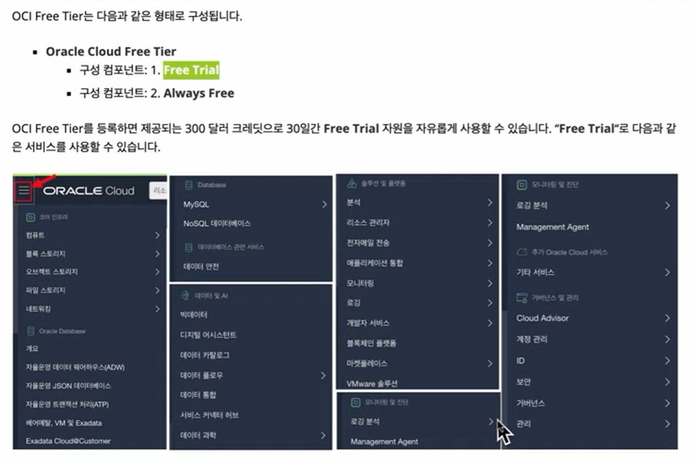
- 30일동안 무료로 사용한 후, 대부분의 서비스는 사용 못하지만 아래의 서비스는 영구적을 사용 가능(Always Free)
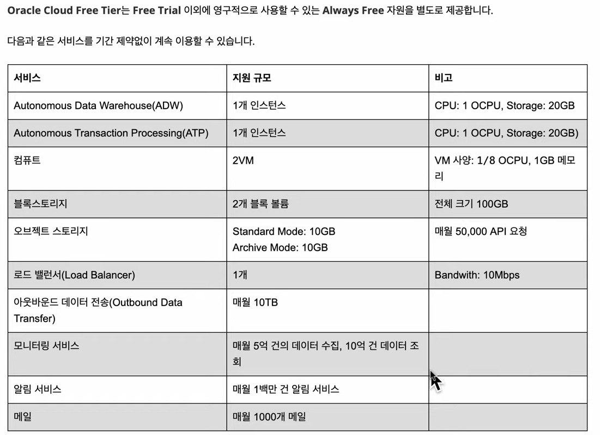
- OCI Free Tier 등록을 위한 준비
  - 사전 결정 사항
    - OCI 계정명 (Tenate)
    - OCI Home Region: 거점 OCI 데이터 센터
  - 사용자 인증을 위한 사전 준비물
    - 메일 주소: gmail, naver, daum등 개인 메일 사용 가능
    - 신용 카드: 해외 결제가 가능한 VISA, MASTER, AMEX
    - Moilbe Phone Number: SMS 수신 용도
  - 부가 정보
    - 등록자 주소(우편 번호 포함)
- OCI Free Tier의 유료 전환에 대한 걱정
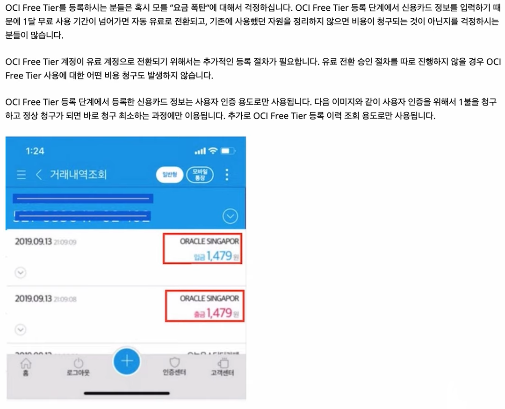

### OCI Free Tier 등록 절차
OCI Free Tier 등록 페이지는 https://cloud.oracle.com 에서 찾을 수 있고, 등록 절차는 아래와 같다.
- Step 01. 계정 정보 입력
  - 기본 계정 정보를 입력
  - 이 단계에서 입력한 Email에 OCI는 메일을 발송하여 등록 메일을 검증
- Step 02. 계정 정보 등록
  - 기본 계정 정보를 등록
    - 국가(지역)
    - 비밀번호
    - 클라우드 계정 이름 (Tenante)
    - Admin 계정명 및 패스워드
    - 홈 영역(Home Region)
- Step 03. 등록자 주소 입력
- Step 04. 전화번호 등록 및 SMS 인증
  - ``010-3123-1234`` => ``82 1031231234``로 등록
- Step 05. 신용카드 등록
- Step 06. 계정 생성

## OCI Tenancy 기본 설정
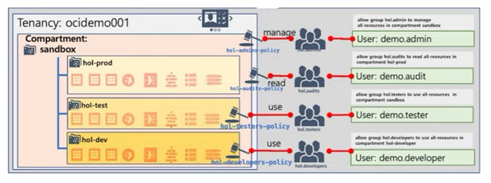
- 새로 만든 OCI Tenancy를 위한 기본 설정을 위하여 다음과 같은 작업을 진행
  - 새로운 OCI 사용자 생성
    - 개발자
    - 운영자
    - 관리자
    - 데이터 분석가
  - 새로운 OCI 사용자 그룹 생성 및 사용자 할당
  - 사용자 패스워드 변경 및 로그인
  - **신규 Compartment 생성**
  - 기본 권한(Policy) 설정
    - Demo Compartment 권한 부여
    - Cloud Shell(가상 리눅스 터미널)을 위한 권한 설정
    - VCN(Virtual Cloud Network) 생성
- 사전 준비 사항
  - OCI Free Tier가 생성 완료된 상태
- OCI Tenancy 기본 정보: OCI Free Tier에서 생성한 정보
  - OCI Tenancy name: gusami32
  - Admin User: gusami32@gmail.com
    - IDCS와 IAM의 두 가지 형태로 존재
  - Admin User Password: !*E*******3
- 배경지식: IDCS & OCI IAM
  - OCI는 사용자 계정을 관리하는 IDCS(Identity Cloud Service)와 OCI IAM 서비스를 제공
  - IDCS는 오라클 클라우드 초기부터 계정 관리와 사용자 권한을 관리하는 체계
  - Gen2가 시작되면서 OCI가 새로운 인프라로 공개
    - OCI 안에서 사용자 계정과 권한을 제공하는 새로운 관리 서비스가 IAM
    - 현재 IDCS는 IAM과 통합되어 있으며, 점진적으로 IAM에 흡수되는 과정에 있음
  - IDCS에서 만든 사용자 ID는 OCI IAM으로 페더레이션됨
    - IDCS는 IDCS Group를 OCI IAM 그룹에 매핍하는 기능을 제공
  - 반대로, OCI IAM에서 생성한 사용자 ID는 IDCS로 페더레이션되지 않음
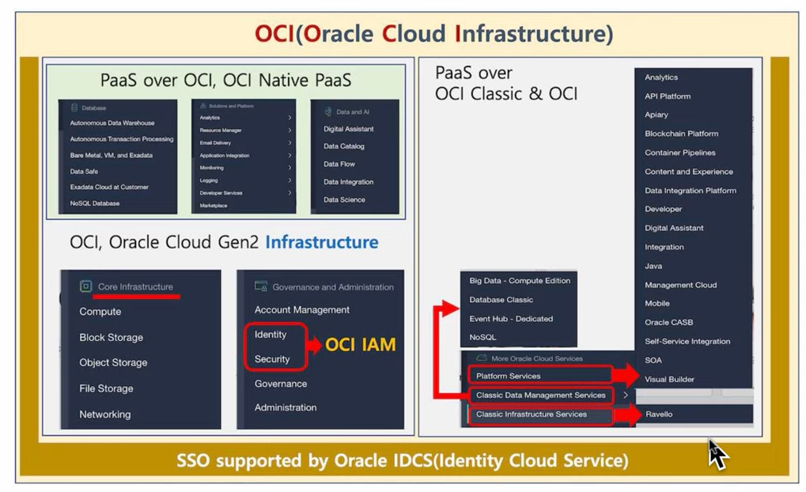
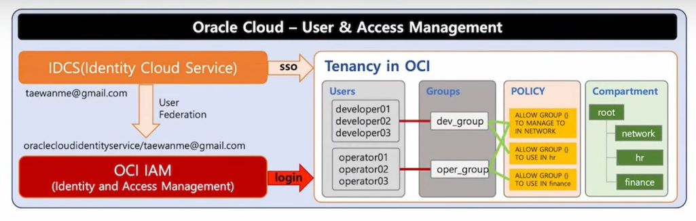
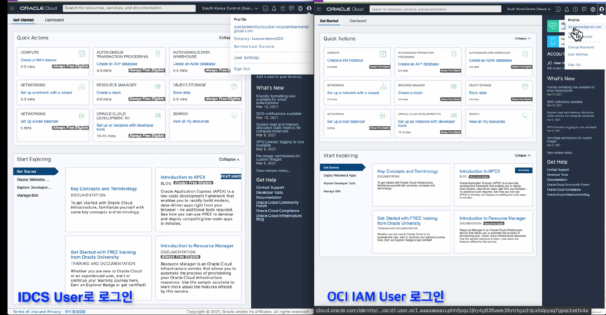
- OCI 사용자 생성: ``gusami32`` Tenancy에 Admin User로 로그인하고, 다음과 같이 OCI IAM 사용자를 생성
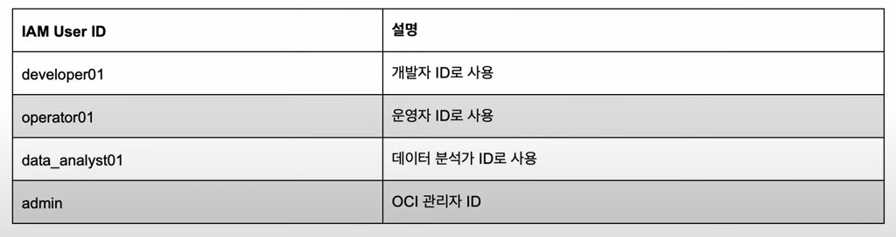
- OCI 사용자 그룹 생성
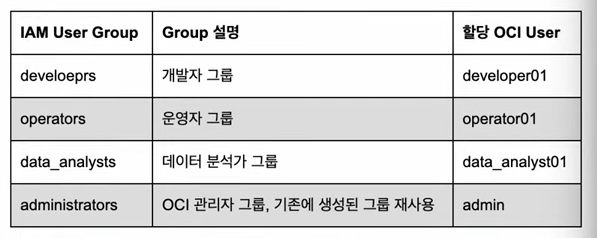
### OCI 사용자 그룹 생성 및 사용자 할당
- 좌측메뉴의 Identity & security > Identity > Domains > ``Default domain`` 선택 > Users
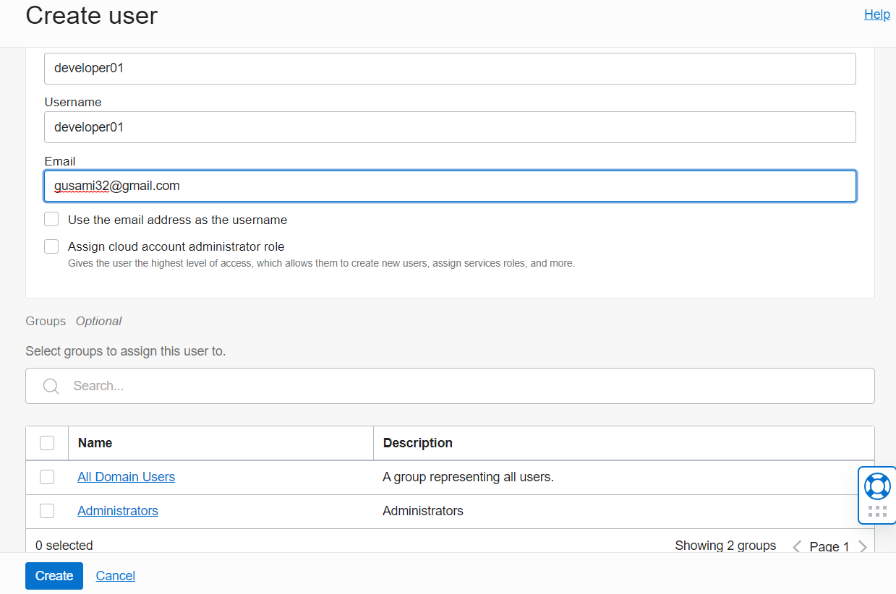
- 생성된 사용자 목록
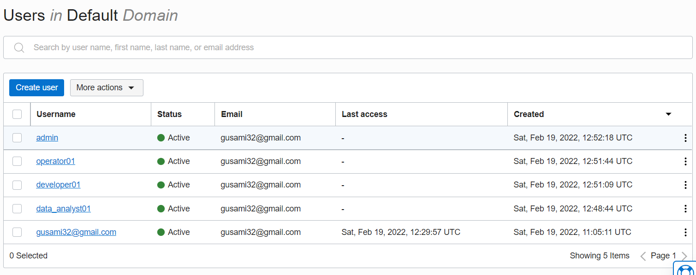
- 좌측메뉴의 Identity & security > Identity > Domains > ``Default domain`` 선택 > Groups
- "Administrators"와 "All Domain Users"란 그룹이 이미 생성되어 있음
  - "Administrators"는 관리자 그룹
  - "Administrators"를 클릭하면, Free Tier를 생성할 때의 사용자인 "gusami32@gmail.com"이 관리자로 등록 되어 있음
- 그룹 생성: 그룹을 생성하면서, 사용자를 할당 가능
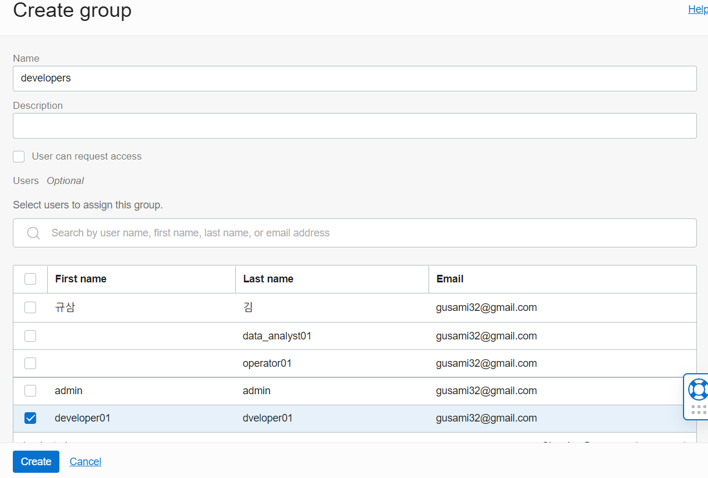
- 생성된 그룹 목록
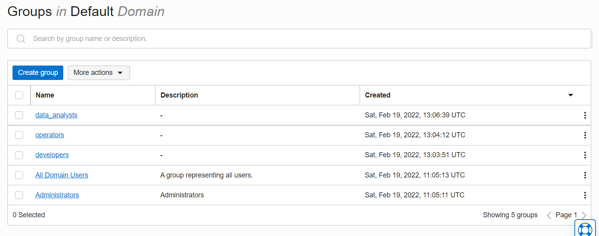
- User의 패스워드 초기화
  - 특정 User를 선택해서 들어가서 ``Reset Password`` 버튼을 클릭
  - 해당 User의 등록된 이메일로 링크가 전달되고, 링크를 클릭하면 비밀번호 재설정화면으로 연결됨
  - developer01/!@E******931
  - data_analyst01/!@E******932
  - operator01/!@E******933
  - admin/!@E******934
### Compartment 생성
- OCI에서 자원(VCN, VM, Database, Storage 및 여러 서비스)을 만들 때, Compartment는 OCI 자원을 논리적으로 묶는 역할을 담당
- Compartment로 여러 자원을 묶고, OCI Compartment 단위로 자원 모니터링, 과금 및 권한 설정
- Compartment는 OCI Cloud 자원을 관리하는 IAM 핵심 구성 요소임
- Compartment는 Root를 기점으로 중첩 디렉토리 구조를 가짐(트리 형태)
- OCI의 모든 Resource들은 특정 Compartment에 속함
- Compartment는 OCI Global 범위를 가짐
  - 특정 Region에 종속적이지 않으며, 특정 Region에서 만든 Compartment는 모든 Region에서 사용 가능
- Compartment는 한국어로 구획으로 번역됨
#### demo Compartment 만들기
- demo compartment 생성은 OCI 관리자 계정(admin or gusami32@gmail.com)으로 진행
- root compartment 아래에 demo compartment를 다음과 같이 설정하고, 생성
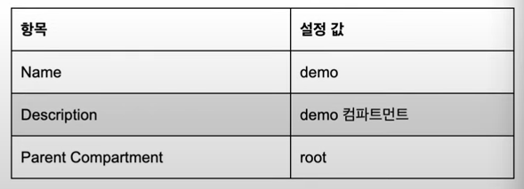
- 좌측메뉴의 Identity & security > Identity > Compartments 선택
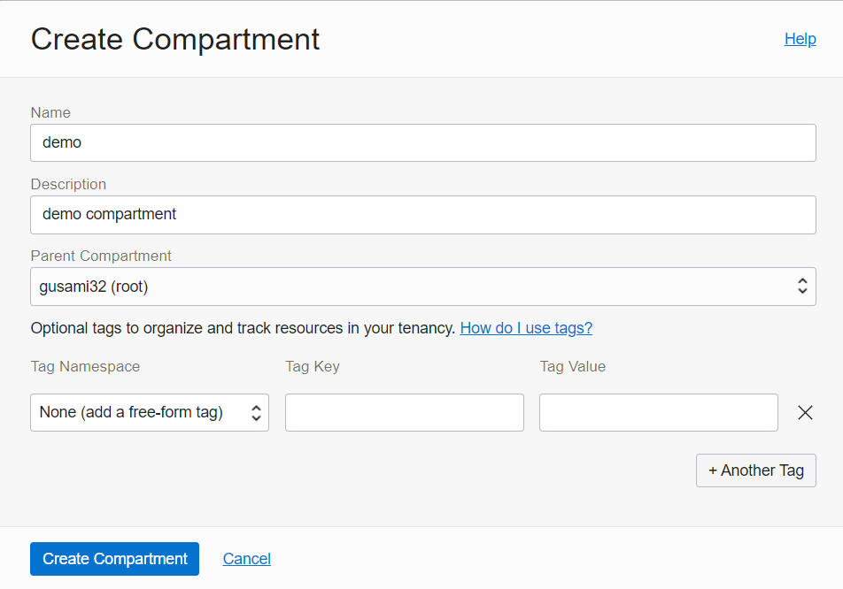
### Policy
- 사용자별로 Resource에 대한 접근 권한을 설정
- OCI에서는 IAM Policy로 OCI Resource 권한 설정을 하고, 기본 문법은 아래와 같음
```bash
Allow <subject> to <verb> <resource-type> in <location> where <conditions>
```
- Policy CASE 1: 특정 OCI Group를 특정 Compartment에 포함된 자원의 접근 제어 설정
```bash
Allow group <group_name> to <verb> <resource-type> in compartment <compartment_name>
```
- Policy CASE 2: 특정 OCI Group이 Tenancy 전체 자원 접근 제어 설정
```bash
Allow group <group_name> to <verb> <resource-type> in tenancy
```
- Policy에 적용하는 verb는 아래와 같음
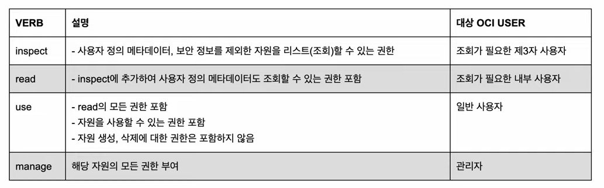
#### demo compartment 권한 부여
- 좌측메뉴의 Identity & security > Identity > Policies
- demo compartment의 policy 설정은 OCI 관리자 계정으로 진행
- demo compartment에 대한 권한을 사용자 그룹 별로 다음과 같이 설정
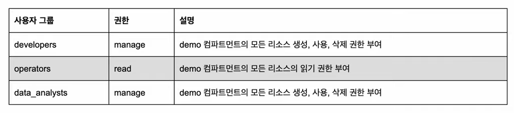
- Policy를 생성: demo compartment의 Policy 설정은 **바로 상위의 root compartment에서 생성**해야 함
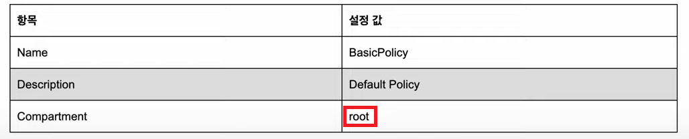
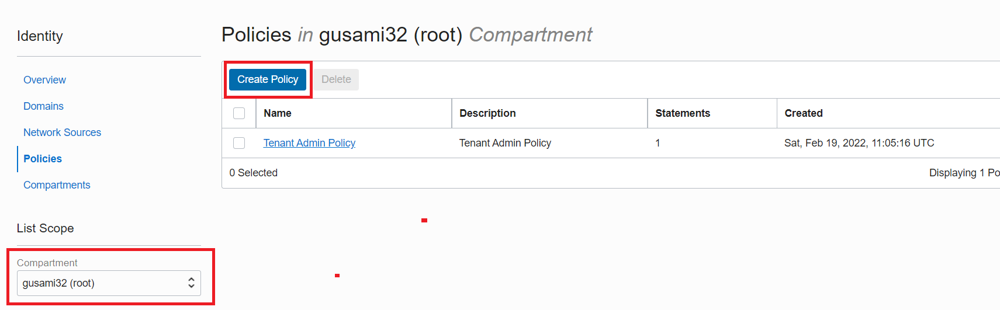
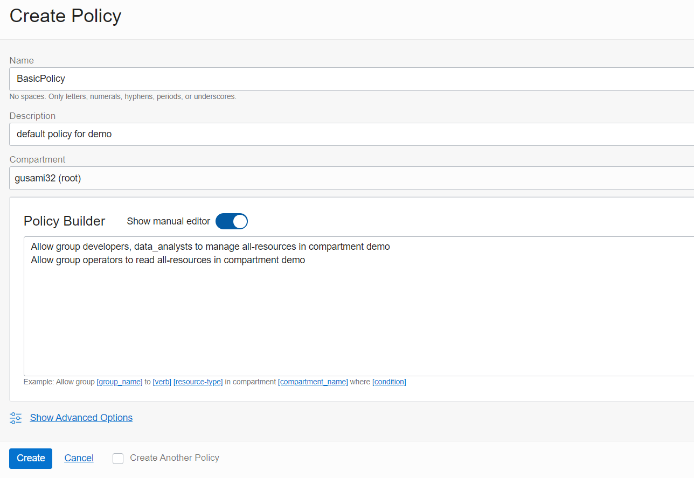
- Policy Builder에 다음과 같은 설정을 입력
```bash
allow group developers, data_analysts to manage all-resources in compartment demo
allow group operators to read all-resources in compartment demo
```
#### Cloud Shell을 위한 Policy 설정
- 좌측메뉴의 ``Identity & security`` > ``Identity`` > ``Policies``
- Cloud Shell은 OCI 관리 Console에서 실행되는 브라우저 기반 가상 터미널
- Cloud Shell을 이용하면 OCI VM 인스턴스에 접속하거나 추가적인 계정 설정없이 OCI CLI와 같은 툴을 사용 가능
- 기본적으로 ``Administrators`` 그룹의 사용자들은 권한없이 Cloud Shell을 사용할 수 있음
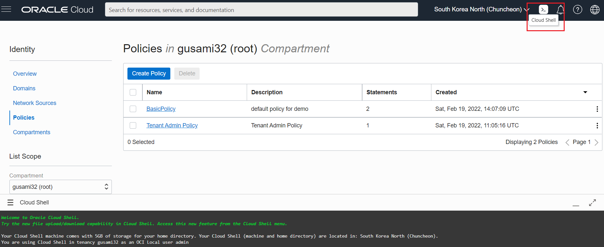
- 일반 OCI 사용자가 Cloud Shell을 사용하기 위해서는 root compartment에 다음 Policy를 설정해야 함
  - **상위의 root compartment에서 생성**
```bash
allow group <group name> to use cloud-shell in tenancy
```
- ``developer01``과 ``data_analyst01`` 사용자가 Cloud Shell을 사용하도록 Policy를 root compartment에 생성
```bash
allow group data_analysts, developers to use cloud-shell in tenancy
```
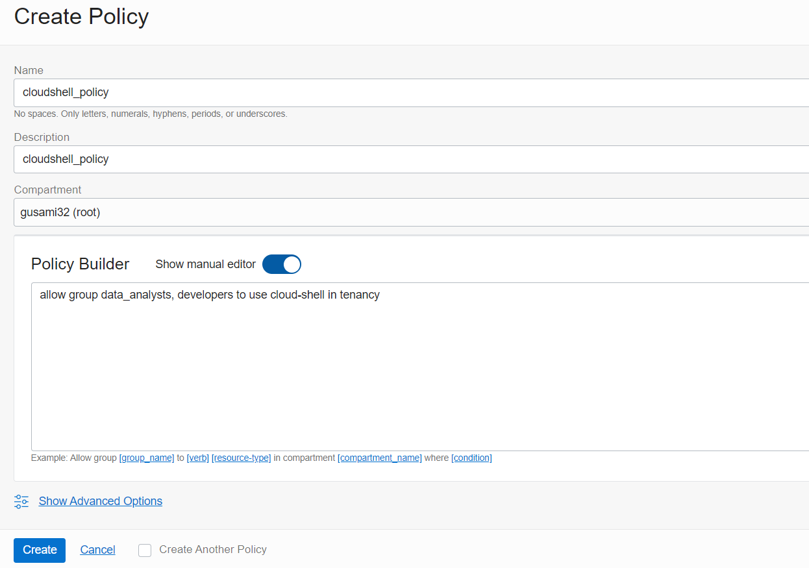
- ``developer01``로 로그인 한 후, Cloud Shell이 잘 실행 되는지 확인
### VCN(Virtual Cloud Network) 생성
- OCI Compute 서비스를 사용하면, 여러 VCN(Virtual Cloud Network)을 생성할 수 있음
- **OCI 자원을 생성/배포하기 위해서는 다른 자원을 생성하기 전에 VCN을 먼저 생성해야 함**
- VCN은 다음과 같은 Network Component로 구성
  - Subnet
  - Route Table
  - Security List
  - Internet Gateway
  - NAT Gateway
  - Service Gateway
  - Dynamic Routing Gateway(DRG)
  - Load Balancer
  - Local/Remote Peering
### demovcn 만들기
- 좌측메뉴의 ``Networking`` > ``Virtual Cloud Networks`` 선택
- **compartment를 demo로 변경**
- 메인 화면의 ``Start VCN Wizard`` > ``VCN with Internet Connectivity`` > ``Start VCN Wizard``
  - VCN Name: demovcn
  - Compartment: demo
  - Configure VCN and subnets
    - VCN CIDR Block: 10.0.0.0/16
    - Public Subnet CIDR Block: 10.0.0.0/24
    - Private Subnet CIDR Block: 10.0.1.0/24
    - DNS Resolution: "Use DNS hostnames in this VCN" 체크
      - Required for instance hostname assignment if you plan to use VCN DNS or a third-party.
      - This choice cannot be changed after the VCN is created.
- 좌측 하단의 "Next" 버튼을 클릭 후, "Create" 버튼을 클릭
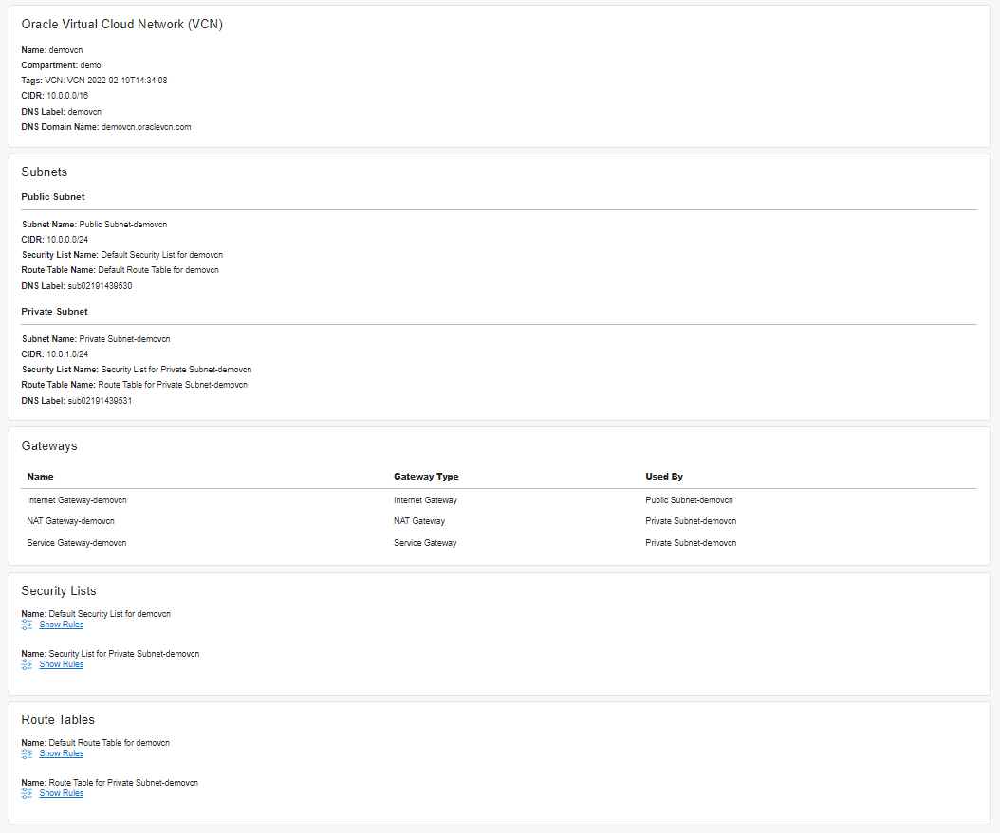
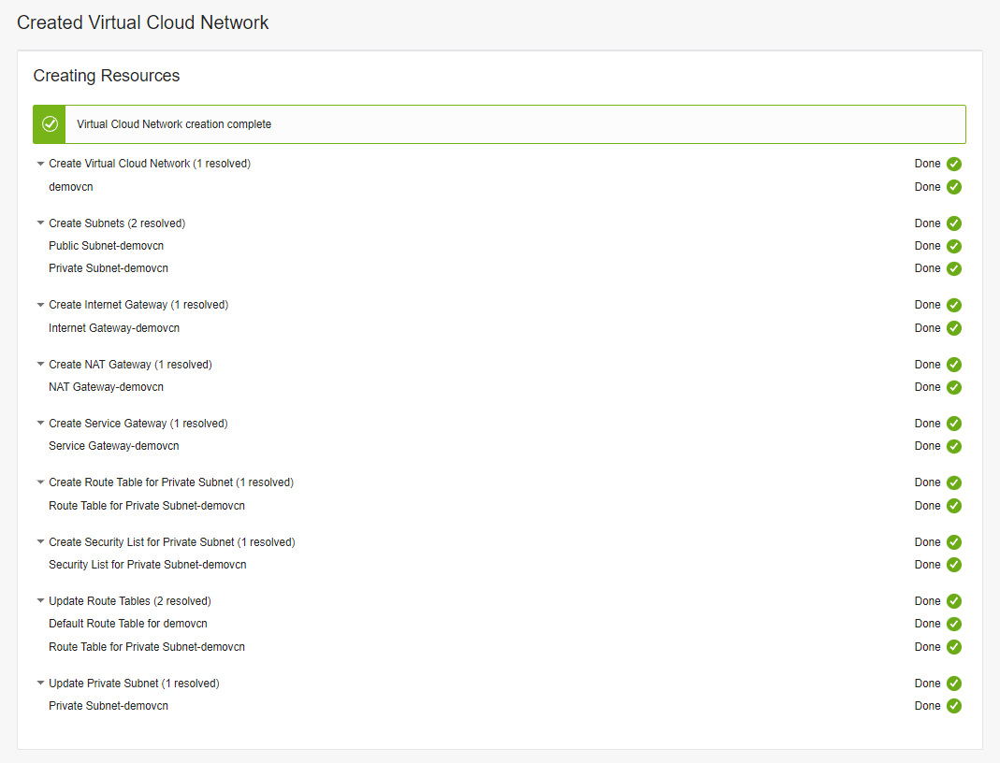
## OKE (Oracle Kubernetes Engine)
- 준비사항: ``demo`` 아래에 새로운 oke를 위한 ``demo_oke`` compartement 생성
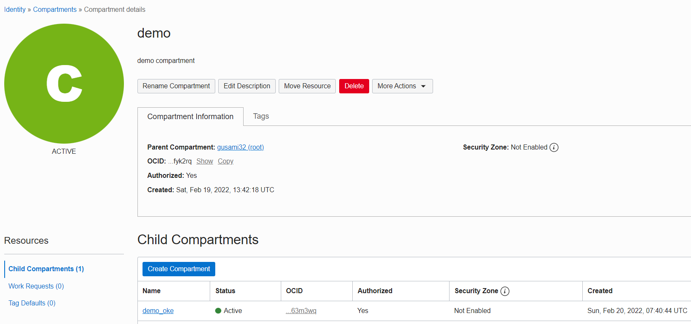
### Cluster 생성
- Step 01: 좌측 메뉴 > Developer Service > Containers & Artifacts > Kubernetes Clusters
- Step 02: ``demo_oke`` compartment 선택 > ``Create Cluster`` > ``Quick Create`` > ``Launch Workflow``
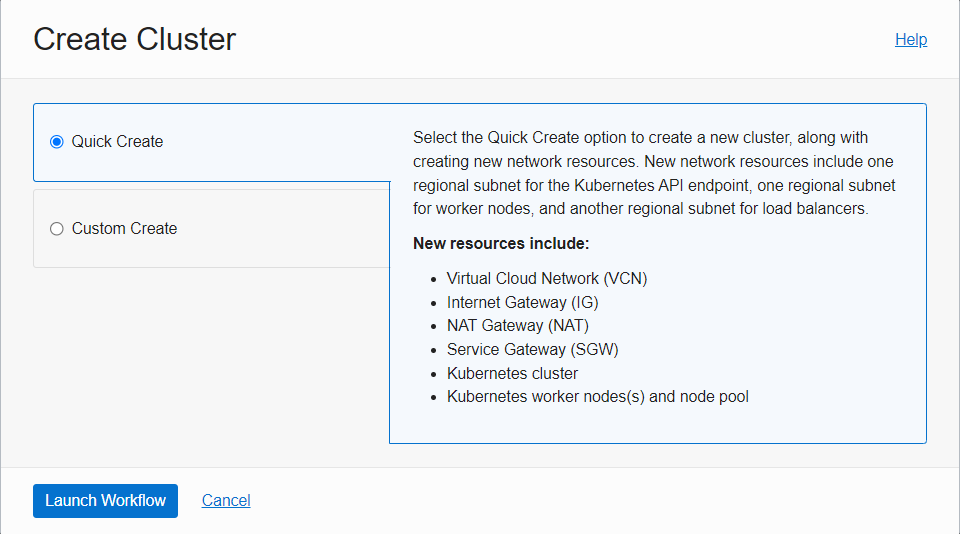
- Step 03: 상세 설정
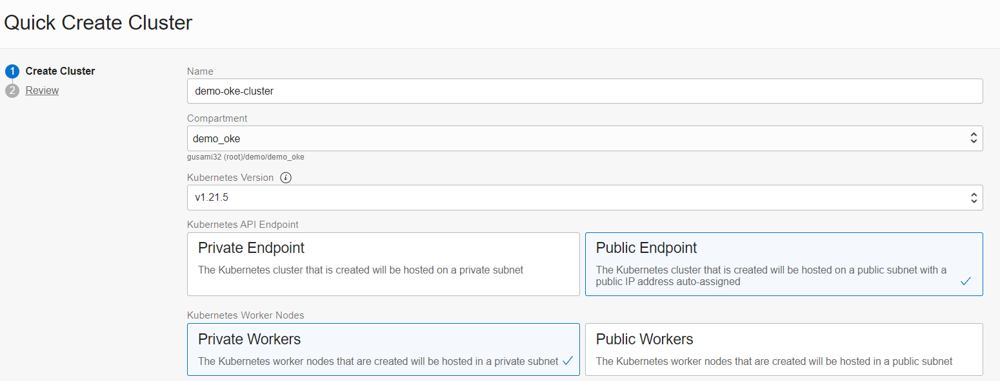
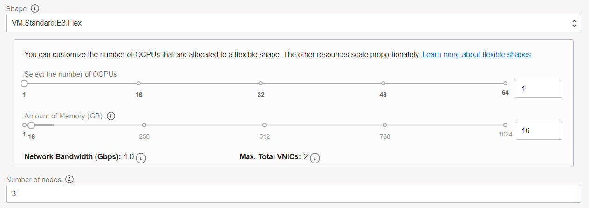
- Step 04: SSH Key Generation & 저장, ``Next`` 버튼 클릭.
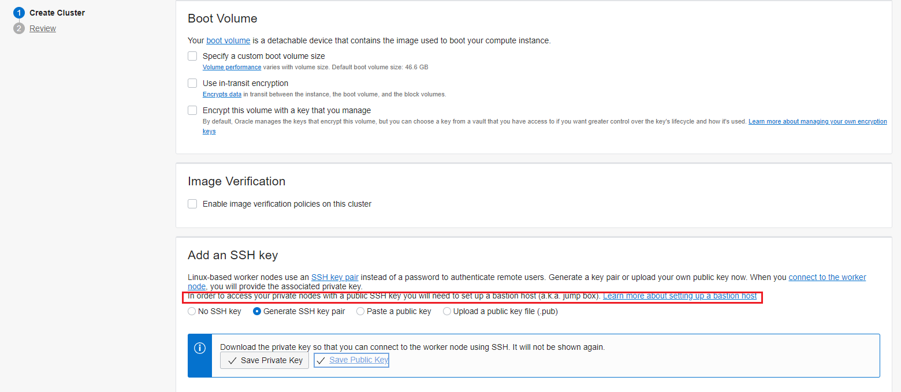

- Step 05: 상세 조건 확인 및 생성
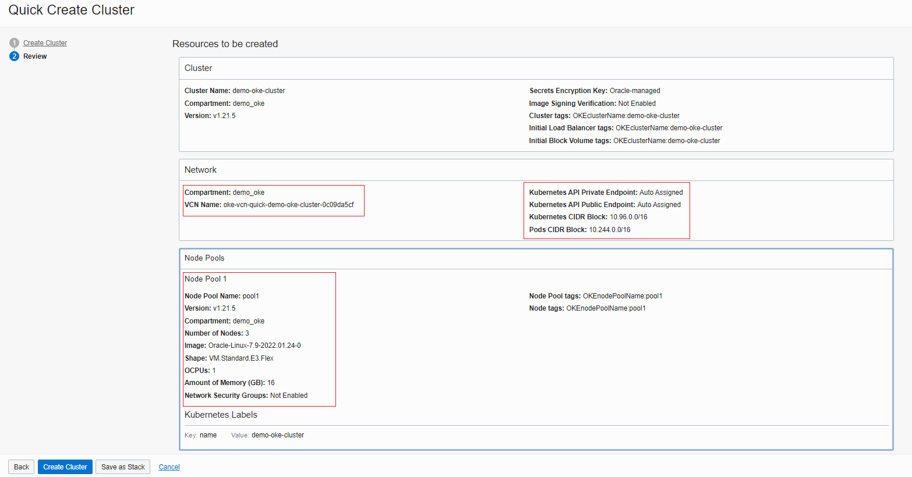
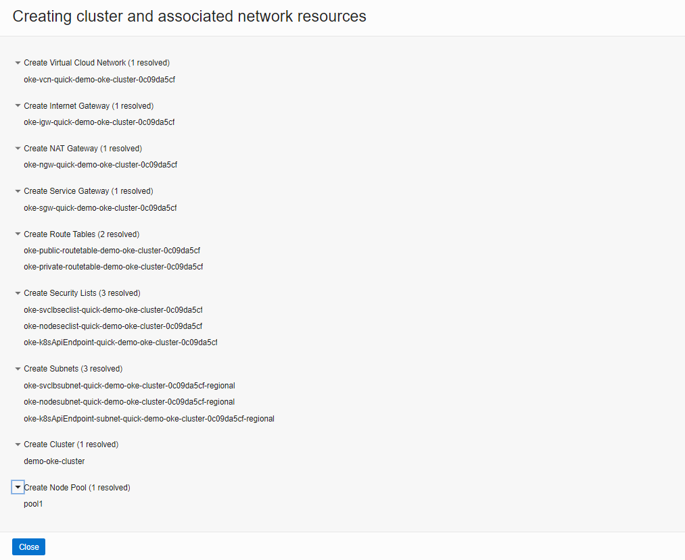

- Step 06: 생성된 Cluster의 상세 정보 확인 (VCN, NodePool)
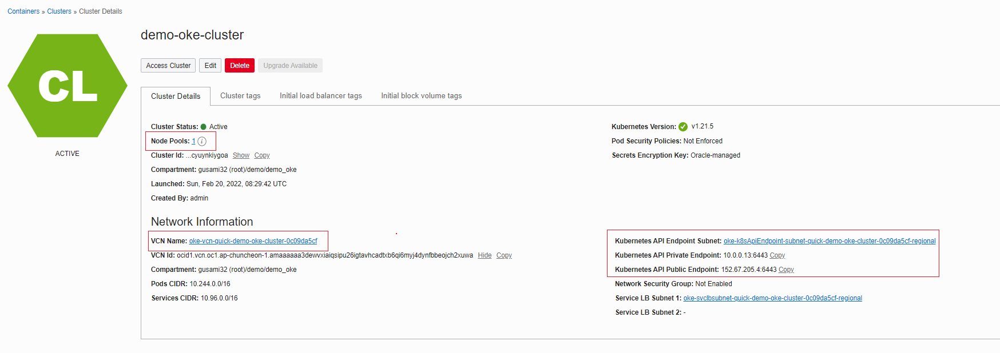
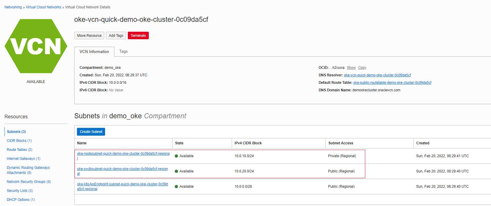
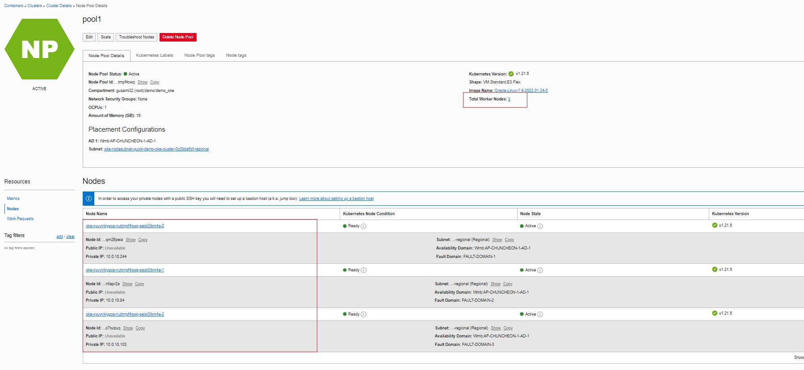

- 부가적인 설정: **Bastion node를 생성하는 방법은 ./doc/bastion-hosts.pdf를 참조**