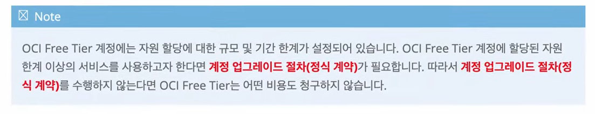
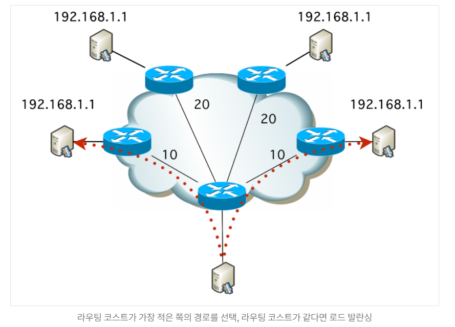
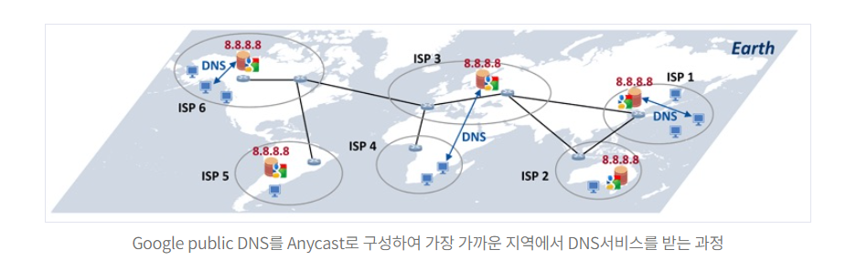
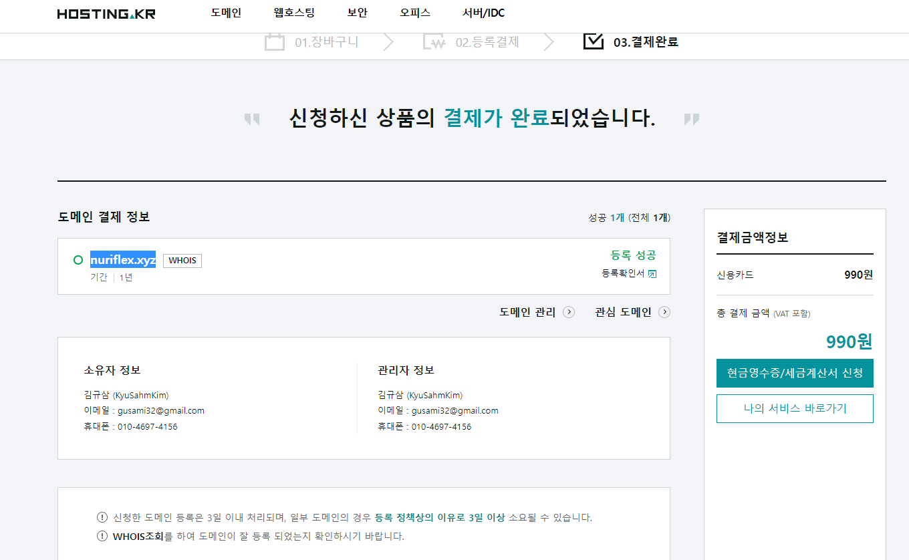
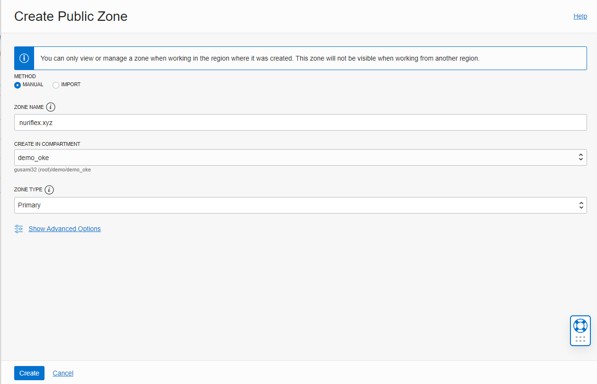
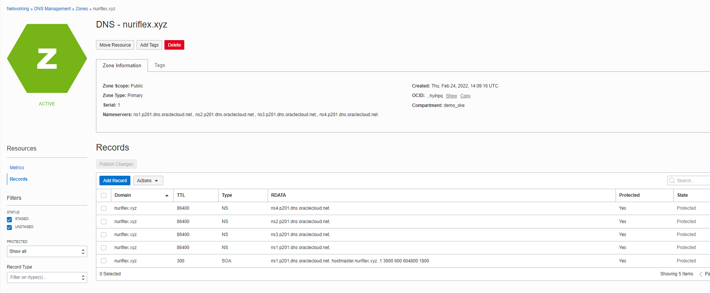
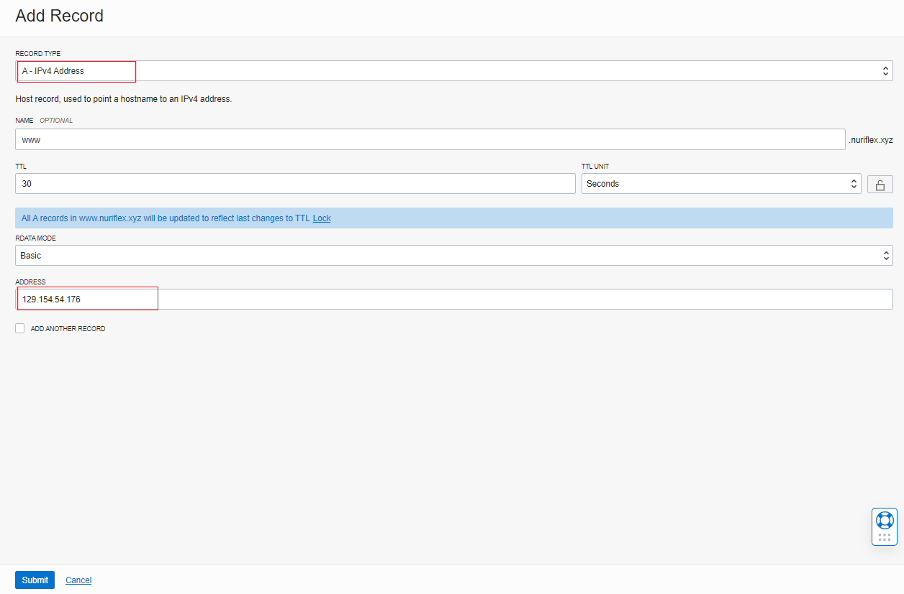
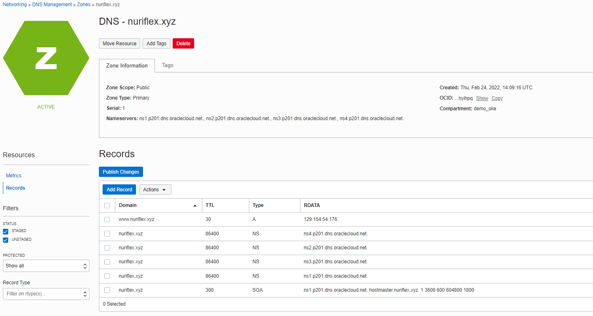
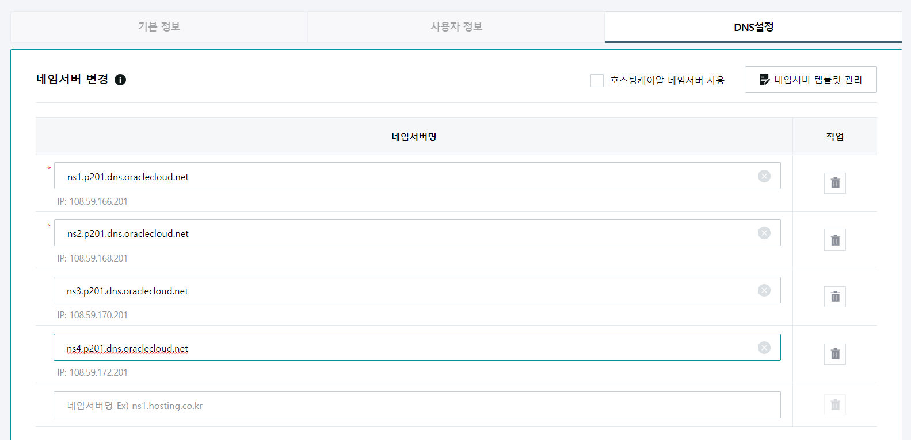

# Oracle Cloud Infrastructure
## OCI Free Tier

- 30일동안 무료로 사용한 후, 대부분의 서비스는 사용 못하지만 아래의 서비스는 영구적을 사용 가능(Always Free)

- OCI Free Tier 등록을 위한 준비
  - 사전 결정 사항
    - OCI 계정명 (Tenate)
    - OCI Home Region: 거점 OCI 데이터 센터
  - 사용자 인증을 위한 사전 준비물
    - 메일 주소: gmail, naver, daum등 개인 메일 사용 가능
    - 신용 카드: 해외 결제가 가능한 VISA, MASTER, AMEX
    - Moilbe Phone Number: SMS 수신 용도
  - 부가 정보
    - 등록자 주소(우편 번호 포함)
- OCI Free Tier의 유료 전환에 대한 걱정


### OCI Free Tier 등록 절차
OCI Free Tier 등록 페이지는 https://cloud.oracle.com 에서 찾을 수 있고, 등록 절차는 아래와 같다.
- Step 01. 계정 정보 입력
  - 기본 계정 정보를 입력
  - 이 단계에서 입력한 Email에 OCI는 메일을 발송하여 등록 메일을 검증
- Step 02. 계정 정보 등록
  - 기본 계정 정보를 등록
    - 국가(지역)
    - 비밀번호
    - 클라우드 계정 이름 (Tenante)
    - Admin 계정명 및 패스워드
    - 홈 영역(Home Region)
- Step 03. 등록자 주소 입력
- Step 04. 전화번호 등록 및 SMS 인증
  - ``010-3123-1234`` => ``82 1031231234``로 등록
- Step 05. 신용카드 등록
- Step 06. 계정 생성

## OCI Tenancy 기본 설정

- 새로 만든 OCI Tenancy를 위한 기본 설정을 위하여 다음과 같은 작업을 진행
  - 새로운 OCI 사용자 생성
    - 개발자
    - 운영자
    - 관리자
    - 데이터 분석가
  - 새로운 OCI 사용자 그룹 생성 및 사용자 할당
  - 사용자 패스워드 변경 및 로그인
  - **신규 Compartment 생성**
  - 기본 권한(Policy) 설정
    - Demo Compartment 권한 부여
    - Cloud Shell(가상 리눅스 터미널)을 위한 권한 설정
    - VCN(Virtual Cloud Network) 생성
- 사전 준비 사항
  - OCI Free Tier가 생성 완료된 상태
- OCI Tenancy 기본 정보: OCI Free Tier에서 생성한 정보
  - OCI Tenancy name: gusami32
  - Admin User: gusami32@gmail.com
    - IDCS와 IAM의 두 가지 형태로 존재
  - Admin User Password: !*E*******3
- 배경지식: IDCS & OCI IAM
  - OCI는 사용자 계정을 관리하는 IDCS(Identity Cloud Service)와 OCI IAM 서비스를 제공
  - IDCS는 오라클 클라우드 초기부터 계정 관리와 사용자 권한을 관리하는 체계
  - Gen2가 시작되면서 OCI가 새로운 인프라로 공개
    - OCI 안에서 사용자 계정과 권한을 제공하는 새로운 관리 서비스가 IAM
    - 현재 IDCS는 IAM과 통합되어 있으며, 점진적으로 IAM에 흡수되는 과정에 있음
  - IDCS에서 만든 사용자 ID는 OCI IAM으로 페더레이션됨
    - IDCS는 IDCS Group를 OCI IAM 그룹에 매핍하는 기능을 제공
  - 반대로, OCI IAM에서 생성한 사용자 ID는 IDCS로 페더레이션되지 않음
  
  
  
- OCI 사용자 생성: ``gusami32`` Tenancy에 Admin User로 로그인하고, 다음과 같이 OCI IAM 사용자를 생성

- OCI 사용자 그룹 생성

### OCI 사용자 그룹 생성 및 사용자 할당
- 좌측메뉴의 Identity & security > Identity > Domains > ``Default domain`` 선택 > Users

- 생성된 사용자 목록

- 좌측메뉴의 Identity & security > Identity > Domains > ``Default domain`` 선택 > Groups
- "Administrators"와 "All Domain Users"란 그룹이 이미 생성되어 있음
  - "Administrators"는 관리자 그룹
  - "Administrators"를 클릭하면, Free Tier를 생성할 때의 사용자인 "gusami32@gmail.com"이 관리자로 등록 되어 있음
- 그룹 생성: 그룹을 생성하면서, 사용자를 할당 가능

- 생성된 그룹 목록

- User의 패스워드 초기화
  - 특정 User를 선택해서 들어가서 ``Reset Password`` 버튼을 클릭
  - 해당 User의 등록된 이메일로 링크가 전달되고, 링크를 클릭하면 비밀번호 재설정화면으로 연결됨
  - developer01/!@E******931
  - data_analyst01/!@E******932
  - operator01/!@E******933
  - admin/!@E******934
### Compartment 생성
- OCI에서 자원(VCN, VM, Database, Storage 및 여러 서비스)을 만들 때, Compartment는 OCI 자원을 논리적으로 묶는 역할을 담당
- Compartment로 여러 자원을 묶고, OCI Compartment 단위로 자원 모니터링, 과금 및 권한 설정
- Compartment는 OCI Cloud 자원을 관리하는 IAM 핵심 구성 요소임
- Compartment는 Root를 기점으로 중첩 디렉토리 구조를 가짐(트리 형태)
- OCI의 모든 Resource들은 특정 Compartment에 속함
- Compartment는 OCI Global 범위를 가짐
  - 특정 Region에 종속적이지 않으며, 특정 Region에서 만든 Compartment는 모든 Region에서 사용 가능
- Compartment는 한국어로 구획으로 번역됨
#### demo Compartment 만들기
- demo compartment 생성은 OCI 관리자 계정(admin or gusami32@gmail.com)으로 진행
- root compartment 아래에 demo compartment를 다음과 같이 설정하고, 생성

- 좌측메뉴의 Identity & security > Identity > Compartments 선택

### Policy
- 사용자별로 Resource에 대한 접근 권한을 설정
- OCI에서는 IAM Policy로 OCI Resource 권한 설정을 하고, 기본 문법은 아래와 같음
```bash
Allow <subject> to <verb> <resource-type> in <location> where <conditions>
```
- Policy CASE 1: 특정 OCI Group를 특정 Compartment에 포함된 자원의 접근 제어 설정
```bash
Allow group <group_name> to <verb> <resource-type> in compartment <compartment_name>
```
- Policy CASE 2: 특정 OCI Group이 Tenancy 전체 자원 접근 제어 설정
```bash
Allow group <group_name> to <verb> <resource-type> in tenancy
```
- Policy에 적용하는 verb는 아래와 같음

#### demo compartment 권한 부여
- 좌측메뉴의 Identity & security > Identity > Policies
- demo compartment의 policy 설정은 OCI 관리자 계정으로 진행
- demo compartment에 대한 권한을 사용자 그룹 별로 다음과 같이 설정

- Policy를 생성: demo compartment의 Policy 설정은 **바로 상위의 root compartment에서 생성**해야 함


- Policy Builder에 다음과 같은 설정을 입력
```bash
allow group developers, data_analysts to manage all-resources in compartment demo
allow group operators to read all-resources in compartment demo
```
#### Cloud Shell을 위한 Policy 설정
- 좌측메뉴의 ``Identity & security`` > ``Identity`` > ``Policies``
- Cloud Shell은 OCI 관리 Console에서 실행되는 브라우저 기반 가상 터미널
- Cloud Shell을 이용하면 OCI VM 인스턴스에 접속하거나 추가적인 계정 설정없이 OCI CLI와 같은 툴을 사용 가능
- 기본적으로 ``Administrators`` 그룹의 사용자들은 권한없이 Cloud Shell을 사용할 수 있음

- 일반 OCI 사용자가 Cloud Shell을 사용하기 위해서는 root compartment에 다음 Policy를 설정해야 함
  - **상위의 root compartment에서 생성**
```bash
allow group <group name> to use cloud-shell in tenancy
```
- ``developer01``과 ``data_analyst01`` 사용자가 Cloud Shell을 사용하도록 Policy를 root compartment에 생성
```bash
allow group data_analysts, developers to use cloud-shell in tenancy
```

- ``developer01``로 로그인 한 후, Cloud Shell이 잘 실행 되는지 확인
### VCN(Virtual Cloud Network) 생성
- OCI Compute 서비스를 사용하면, 여러 VCN(Virtual Cloud Network)을 생성할 수 있음
- **OCI 자원을 생성/배포하기 위해서는 다른 자원을 생성하기 전에 VCN을 먼저 생성해야 함**
- VCN은 다음과 같은 Network Component로 구성
  - Subnet
  - Route Table
  - Security List
  - Internet Gateway
  - NAT Gateway
  - Service Gateway
  - Dynamic Routing Gateway(DRG)
  - Load Balancer
  - Local/Remote Peering
### demovcn 만들기
- 좌측메뉴의 ``Networking`` > ``Virtual Cloud Networks`` 선택
- **compartment를 demo로 변경**
- 메인 화면의 ``Start VCN Wizard`` > ``VCN with Internet Connectivity`` > ``Start VCN Wizard``
  - VCN Name: demovcn
  - Compartment: demo
  - Configure VCN and subnets
    - VCN CIDR Block: 10.0.0.0/16
    - Public Subnet CIDR Block: 10.0.0.0/24
    - Private Subnet CIDR Block: 10.0.1.0/24
    - DNS Resolution: "Use DNS hostnames in this VCN" 체크
      - Required for instance hostname assignment if you plan to use VCN DNS or a third-party.
      - This choice cannot be changed after the VCN is created.
- 좌측 하단의 "Next" 버튼을 클릭 후, "Create" 버튼을 클릭


## OKE (Oracle Kubernetes Engine)
- 준비사항: ``demo`` 아래에 새로운 oke를 위한 ``demo_oke`` compartement 생성

### Cluster 생성
- Step 01: 좌측 메뉴 > Developer Service > Containers & Artifacts > Kubernetes Clusters
- Step 02: ``demo_oke`` compartment 선택 > ``Create Cluster`` > ``Quick Create`` > ``Launch Workflow``

- Step 03: 상세 설정


- Step 04: SSH Key Generation & 저장, ``Next`` 버튼 클릭.


- Step 05: 상세 조건 확인 및 생성


- Step 06: 생성된 Cluster의 상세 정보 확인 (VCN, NodePool)


- 부가적인 설정: **Bastion node를 생성하는 방법은 ./doc/bastion-hosts.pdf를 참조**
## Web Sevice on OKE
### Cluster에 Access 하는 방법
- ``Developer Services > Containers & Artifacts > Kubernetes Clusters (OKE) > demo-oke-cluster``에서 ``Access Cluster`` 선택
- 방법 1: Cloud Shell Access
  - Launch Cloud Shell
  - execute following command in cloud shell  
- 방법 2: Local Access
### NGINX ingress controller
- 설치 방법
  - https://kubernetes.github.io/ingress-nginx/deploy/
  - 위 문서의 "Oracle Cloud Infrastrure"를 참조   
```bash
$kubectl apply -f https://raw.githubusercontent.com/kubernetes/ingress-nginx/controller-v1.1.1/deploy/static/provider/cloud/deploy.yaml
```
- Bear Metal VS OKE (Oracle Cloud InfraStructure) : NodePort 서비스 VS LoadBalancer


- 실습
  - Step 01: OCI Cloud Shell 실행
```bash
# 현재 위치 확인
admin@cloudshell:~ (ap-chuncheon-1)$pwd
/home/admin
# execute cluster access command
admin@cloudshell:~ (ap-chuncheon-1)$oci ce cluster create-kubeconfig --cluster-id ocid1.cluster.oc1.ap-chuncheon-1.aaaaaaaasra62uwuk3zwn2p4t47w6tezuk5ae3sswashtr2mqcyuynkiygoa --file $HOME/.kube/config --region ap-chuncheon-1 --token-version 2.0.0  --kube-endpoint PUBLIC_ENDPOINT
New config written to the Kubeconfig file /home/admin/.kube/config
# get context information of demo-oke-cluster
admin@cloudshell:~ (ap-chuncheon-1)$kubectl config get-contexts
CURRENT   NAME                  CLUSTER               AUTHINFO           NAMESPACE
*         context-cyuynkiygoa   cluster-cyuynkiygoa   user-cyuynkiygoa
# cluster와 context 상세 정보 보기
admin@cloudshell:~ (ap-chuncheon-1)$ kubectl config view
apiVersion: v1
clusters:
- cluster:
    certificate-authority-data: DATA+OMITTED
    server: https://152.67.205.4:6443
  name: cluster-cyuynkiygoa
contexts:
- context:
    cluster: cluster-cyuynkiygoa
    user: user-cyuynkiygoa
  name: context-cyuynkiygoa
current-context: context-cyuynkiygoa
kind: Config
preferences: {}
users:
- name: user-cyuynkiygoa
  user:
    exec:
      apiVersion: client.authentication.k8s.io/v1beta1
      args:
      - ce
      - cluster
      - generate-token
      - --cluster-id
      - ocid1.cluster.oc1.ap-chuncheon-1.aaaaaaaasra62uwuk3zwn2p4t47w6tezuk5ae3sswashtr2mqcyuynkiygoa
      - --region
      - ap-chuncheon-1
      command: oci
      env: []
      provideClusterInfo: false
# Webservice 구성         
# Step 01: ingress controller yaml 파일 다운로드
admin@cloudshell:~ (ap-chuncheon-1)$wget https://raw.githubusercontent.com/kubernetes/ingress-nginx/controller-v1.1.1/deploy/static/provider/cloud/deploy.yaml
--2022-02-20 09:02:30--  https://raw.githubusercontent.com/kubernetes/ingress-nginx/controller-v1.1.1/deploy/static/provider/cloud/deploy.yaml
Resolving raw.githubusercontent.com (raw.githubusercontent.com)... 185.199.110.133, 185.199.111.133, 185.199.108.133, ...
Connecting to raw.githubusercontent.com (raw.githubusercontent.com)|185.199.110.133|:443... connected.
HTTP request sent, awaiting response... 200 OK
Length: 19299 (19K) [text/plain]
Saving to: ‘deploy.yaml’

100%[=====================================================================================================================================================================>] 19,299      --.-K/s   in 0.01s   

2022-02-20 09:02:30 (1.26 MB/s) - ‘deploy.yaml’ saved [19299/19299]
# NGINX ingress controller 파일을 살펴보자.
# 1. "ingress-nginx"라는 Namespace 생성
# 2. Service Account 생성 (인증을 위해서 생성). 뒤쪽에서 배움. Role and Role binding
# 3. ConfigMap 정의
# 4. ClusterRole, ClusterRoleBinding 정의
# 5. Role, RoleBinding 정의
# 6. ClusterIP, LoadBalancer 서비스 정의 (중요)
#  - 아래의 "ingress-nginx" pod를 ClusterIP와 LoadBalancer 서비스로 제공
#  - LoadBalancer 서비스: 외부로 노출된 External IP와 Port를 제공
#  - LoadBalancer 서비스 경우, http와 https를 위한 Port(80, 443)를 제공. 결국, "ingress-nginx" pod가 http와 https 웹서버 기능 제공
#  - 결국, LoadBalancer 서비스의 open된 port를 통해서 외부 사용자에게 내부의 서비스들을 제공 (중요)
# 7. Deployment Controller 정의 (중요)
#  - "ingress-nginx" pod를 생성하는 것을 담당
#  - "ingress-nginx" pod가 ingress rule을 처리하고, HTTP와 HTTPS 서비스를 제공
#  - 이미지가 "k8s.gcr.io/ingress-nginx/controller:v1.1"인 Pod 생성
#  - ReplicaSet가 정의되지 않았으므로, 1개의 Pod만을 수행
#  - Pod의 container 생성 시, 인자로 "--controller-class=k8s.io/ingress-nginx" IngressClass 지정
# 8. IngressClass 정의 (중요)
#  - ingress controller pod인 "ingress-nginx"와 ingress rule을 연결하는 작업을 하는 듯함
#  - controller 항목인 "controller: k8s.io/ingress-nginx"가 Pod 생성 시, 인자로 사용
#  - name항목의 "name: nginx"가 ingress rule 생성시, ingressClassName으로 사용
# 9. 기타 작업 
#  - serviceaccount
#  - clusterrole, clusterrolebinding
#  - role, rolebinding
#  - job

admin@cloudshell:~ (ap-chuncheon-1)$cat deploy.yaml 

apiVersion: v1
kind: Namespace
metadata:
  name: ingress-nginx
  labels:
    app.kubernetes.io/name: ingress-nginx
    app.kubernetes.io/instance: ingress-nginx

---
# Source: ingress-nginx/templates/controller-serviceaccount.yaml
apiVersion: v1
kind: ServiceAccount
metadata:
  labels:
    helm.sh/chart: ingress-nginx-4.0.15
    app.kubernetes.io/name: ingress-nginx
    app.kubernetes.io/instance: ingress-nginx
    app.kubernetes.io/version: 1.1.1
    app.kubernetes.io/managed-by: Helm
    app.kubernetes.io/component: controller
  name: ingress-nginx
  namespace: ingress-nginx
automountServiceAccountToken: true
---
# Source: ingress-nginx/templates/controller-configmap.yaml
apiVersion: v1
kind: ConfigMap
metadata:
  labels:
    helm.sh/chart: ingress-nginx-4.0.15
    app.kubernetes.io/name: ingress-nginx
    app.kubernetes.io/instance: ingress-nginx
    app.kubernetes.io/version: 1.1.1
    app.kubernetes.io/managed-by: Helm
    app.kubernetes.io/component: controller
  name: ingress-nginx-controller
  namespace: ingress-nginx
data:
  allow-snippet-annotations: 'true'
---
# Source: ingress-nginx/templates/clusterrole.yaml
apiVersion: rbac.authorization.k8s.io/v1
kind: ClusterRole
metadata:
  labels:
    helm.sh/chart: ingress-nginx-4.0.15
    app.kubernetes.io/name: ingress-nginx
    app.kubernetes.io/instance: ingress-nginx
    app.kubernetes.io/version: 1.1.1
    app.kubernetes.io/managed-by: Helm
  name: ingress-nginx
rules:
  - apiGroups:
      - ''
    resources:
      - configmaps
      - endpoints
      - nodes
      - pods
      - secrets
      - namespaces
    verbs:
      - list
      - watch
  - apiGroups:
      - ''
    resources:
      - nodes
    verbs:
      - get
  - apiGroups:
      - ''
    resources:
      - services
    verbs:
      - get
      - list
      - watch
  - apiGroups:
      - networking.k8s.io
    resources:
      - ingresses
    verbs:
      - get
      - list
      - watch
  - apiGroups:
      - ''
    resources:
      - events
    verbs:
      - create
      - patch
  - apiGroups:
      - networking.k8s.io
    resources:
      - ingresses/status
    verbs:
      - update
  - apiGroups:
      - networking.k8s.io
    resources:
      - ingressclasses
    verbs:
      - get
      - list
      - watch
---
# Source: ingress-nginx/templates/clusterrolebinding.yaml
apiVersion: rbac.authorization.k8s.io/v1
kind: ClusterRoleBinding
metadata:
  labels:
    helm.sh/chart: ingress-nginx-4.0.15
    app.kubernetes.io/name: ingress-nginx
    app.kubernetes.io/instance: ingress-nginx
    app.kubernetes.io/version: 1.1.1
    app.kubernetes.io/managed-by: Helm
  name: ingress-nginx
roleRef:
  apiGroup: rbac.authorization.k8s.io
  kind: ClusterRole
  name: ingress-nginx
subjects:
  - kind: ServiceAccount
    name: ingress-nginx
    namespace: ingress-nginx
---
# Source: ingress-nginx/templates/controller-role.yaml
apiVersion: rbac.authorization.k8s.io/v1
kind: Role
metadata:
  labels:
    helm.sh/chart: ingress-nginx-4.0.15
    app.kubernetes.io/name: ingress-nginx
    app.kubernetes.io/instance: ingress-nginx
    app.kubernetes.io/version: 1.1.1
    app.kubernetes.io/managed-by: Helm
    app.kubernetes.io/component: controller
  name: ingress-nginx
  namespace: ingress-nginx
rules:
  - apiGroups:
      - ''
    resources:
      - namespaces
    verbs:
      - get
  - apiGroups:
      - ''
    resources:
      - configmaps
      - pods
      - secrets
      - endpoints
    verbs:
      - get
      - list
      - watch
  - apiGroups:
      - ''
    resources:
      - services
    verbs:
      - get
      - list
      - watch
  - apiGroups:
      - networking.k8s.io
    resources:
      - ingresses
    verbs:
      - get
      - list
      - watch
  - apiGroups:
      - networking.k8s.io
    resources:
      - ingresses/status
    verbs:
      - update
  - apiGroups:
      - networking.k8s.io
    resources:
      - ingressclasses
    verbs:
      - get
      - list
      - watch
  - apiGroups:
      - ''
    resources:
      - configmaps
    resourceNames:
      - ingress-controller-leader
    verbs:
      - get
      - update
  - apiGroups:
      - ''
    resources:
      - configmaps
    verbs:
      - create
  - apiGroups:
      - ''
    resources:
      - events
    verbs:
      - create
      - patch
---
# Source: ingress-nginx/templates/controller-rolebinding.yaml
apiVersion: rbac.authorization.k8s.io/v1
kind: RoleBinding
metadata:
  labels:
    helm.sh/chart: ingress-nginx-4.0.15
    app.kubernetes.io/name: ingress-nginx
    app.kubernetes.io/instance: ingress-nginx
    app.kubernetes.io/version: 1.1.1
    app.kubernetes.io/managed-by: Helm
    app.kubernetes.io/component: controller
  name: ingress-nginx
  namespace: ingress-nginx
roleRef:
  apiGroup: rbac.authorization.k8s.io
  kind: Role
  name: ingress-nginx
subjects:
  - kind: ServiceAccount
    name: ingress-nginx
    namespace: ingress-nginx
---
# Source: ingress-nginx/templates/controller-service-webhook.yaml
apiVersion: v1
kind: Service
metadata:
  labels:
    helm.sh/chart: ingress-nginx-4.0.15
    app.kubernetes.io/name: ingress-nginx
    app.kubernetes.io/instance: ingress-nginx
    app.kubernetes.io/version: 1.1.1
    app.kubernetes.io/managed-by: Helm
    app.kubernetes.io/component: controller
  name: ingress-nginx-controller-admission
  namespace: ingress-nginx
spec:
  type: ClusterIP
  ports:
    - name: https-webhook
      port: 443
      targetPort: webhook
      appProtocol: https
  selector:
    app.kubernetes.io/name: ingress-nginx
    app.kubernetes.io/instance: ingress-nginx
    app.kubernetes.io/component: controller
---
# Source: ingress-nginx/templates/controller-service.yaml
apiVersion: v1
kind: Service
metadata:
  annotations:
  labels:
    helm.sh/chart: ingress-nginx-4.0.15
    app.kubernetes.io/name: ingress-nginx
    app.kubernetes.io/instance: ingress-nginx
    app.kubernetes.io/version: 1.1.1
    app.kubernetes.io/managed-by: Helm
    app.kubernetes.io/component: controller
  name: ingress-nginx-controller
  namespace: ingress-nginx
spec:
  type: LoadBalancer
  externalTrafficPolicy: Local
  ipFamilyPolicy: SingleStack
  ipFamilies:
    - IPv4
  ports:
    - name: http
      port: 80
      protocol: TCP
      targetPort: http
      appProtocol: http
    - name: https
      port: 443
      protocol: TCP
      targetPort: https
      appProtocol: https
  selector:
    app.kubernetes.io/name: ingress-nginx
    app.kubernetes.io/instance: ingress-nginx
    app.kubernetes.io/component: controller
---
# Source: ingress-nginx/templates/controller-deployment.yaml
apiVersion: apps/v1
kind: Deployment
metadata:
  labels:
    helm.sh/chart: ingress-nginx-4.0.15
    app.kubernetes.io/name: ingress-nginx
    app.kubernetes.io/instance: ingress-nginx
    app.kubernetes.io/version: 1.1.1
    app.kubernetes.io/managed-by: Helm
    app.kubernetes.io/component: controller
  name: ingress-nginx-controller
  namespace: ingress-nginx
spec:
  selector:
    matchLabels:
      app.kubernetes.io/name: ingress-nginx
      app.kubernetes.io/instance: ingress-nginx
      app.kubernetes.io/component: controller
  revisionHistoryLimit: 10
  minReadySeconds: 0
  template:
    metadata:
      labels:
        app.kubernetes.io/name: ingress-nginx
        app.kubernetes.io/instance: ingress-nginx
        app.kubernetes.io/component: controller
    spec:
      dnsPolicy: ClusterFirst
      containers:
        - name: controller
          image: k8s.gcr.io/ingress-nginx/controller:v1.1.1@sha256:0bc88eb15f9e7f84e8e56c14fa5735aaa488b840983f87bd79b1054190e660de
          imagePullPolicy: IfNotPresent
          lifecycle:
            preStop:
              exec:
                command:
                  - /wait-shutdown
          args:
            - /nginx-ingress-controller
            - --publish-service=$(POD_NAMESPACE)/ingress-nginx-controller
            - --election-id=ingress-controller-leader
            - --controller-class=k8s.io/ingress-nginx
            - --configmap=$(POD_NAMESPACE)/ingress-nginx-controller
            - --validating-webhook=:8443
            - --validating-webhook-certificate=/usr/local/certificates/cert
            - --validating-webhook-key=/usr/local/certificates/key
          securityContext:
            capabilities:
              drop:
                - ALL
              add:
                - NET_BIND_SERVICE
            runAsUser: 101
            allowPrivilegeEscalation: true
          env:
            - name: POD_NAME
              valueFrom:
                fieldRef:
                  fieldPath: metadata.name
            - name: POD_NAMESPACE
              valueFrom:
                fieldRef:
                  fieldPath: metadata.namespace
            - name: LD_PRELOAD
              value: /usr/local/lib/libmimalloc.so
          livenessProbe:
            failureThreshold: 5
            httpGet:
              path: /healthz
              port: 10254
              scheme: HTTP
            initialDelaySeconds: 10
            periodSeconds: 10
            successThreshold: 1
            timeoutSeconds: 1
          readinessProbe:
            failureThreshold: 3
            httpGet:
              path: /healthz
              port: 10254
              scheme: HTTP
            initialDelaySeconds: 10
            periodSeconds: 10
            successThreshold: 1
            timeoutSeconds: 1
          ports:
            - name: http
              containerPort: 80
              protocol: TCP
            - name: https
              containerPort: 443
              protocol: TCP
            - name: webhook
              containerPort: 8443
              protocol: TCP
          volumeMounts:
            - name: webhook-cert
              mountPath: /usr/local/certificates/
              readOnly: true
          resources:
            requests:
              cpu: 100m
              memory: 90Mi
      nodeSelector:
        kubernetes.io/os: linux
      serviceAccountName: ingress-nginx
      terminationGracePeriodSeconds: 300
      volumes:
        - name: webhook-cert
          secret:
            secretName: ingress-nginx-admission
---
# Source: ingress-nginx/templates/controller-ingressclass.yaml
# We don't support namespaced ingressClass yet
# So a ClusterRole and a ClusterRoleBinding is required
apiVersion: networking.k8s.io/v1
kind: IngressClass
metadata:
  labels:
    helm.sh/chart: ingress-nginx-4.0.15
    app.kubernetes.io/name: ingress-nginx
    app.kubernetes.io/instance: ingress-nginx
    app.kubernetes.io/version: 1.1.1
    app.kubernetes.io/managed-by: Helm
    app.kubernetes.io/component: controller
  name: nginx
  namespace: ingress-nginx
spec:
  controller: k8s.io/ingress-nginx
---
# Source: ingress-nginx/templates/admission-webhooks/validating-webhook.yaml
# before changing this value, check the required kubernetes version
# https://kubernetes.io/docs/reference/access-authn-authz/extensible-admission-controllers/#prerequisites
apiVersion: admissionregistration.k8s.io/v1
kind: ValidatingWebhookConfiguration
metadata:
  labels:
    helm.sh/chart: ingress-nginx-4.0.15
    app.kubernetes.io/name: ingress-nginx
    app.kubernetes.io/instance: ingress-nginx
    app.kubernetes.io/version: 1.1.1
    app.kubernetes.io/managed-by: Helm
    app.kubernetes.io/component: admission-webhook
  name: ingress-nginx-admission
webhooks:
  - name: validate.nginx.ingress.kubernetes.io
    matchPolicy: Equivalent
    rules:
      - apiGroups:
          - networking.k8s.io
        apiVersions:
          - v1
        operations:
          - CREATE
          - UPDATE
        resources:
          - ingresses
    failurePolicy: Fail
    sideEffects: None
    admissionReviewVersions:
      - v1
    clientConfig:
      service:
        namespace: ingress-nginx
        name: ingress-nginx-controller-admission
        path: /networking/v1/ingresses
---
# Source: ingress-nginx/templates/admission-webhooks/job-patch/serviceaccount.yaml
apiVersion: v1
kind: ServiceAccount
metadata:
  name: ingress-nginx-admission
  namespace: ingress-nginx
  annotations:
    helm.sh/hook: pre-install,pre-upgrade,post-install,post-upgrade
    helm.sh/hook-delete-policy: before-hook-creation,hook-succeeded
  labels:
    helm.sh/chart: ingress-nginx-4.0.15
    app.kubernetes.io/name: ingress-nginx
    app.kubernetes.io/instance: ingress-nginx
    app.kubernetes.io/version: 1.1.1
    app.kubernetes.io/managed-by: Helm
    app.kubernetes.io/component: admission-webhook
---
# Source: ingress-nginx/templates/admission-webhooks/job-patch/clusterrole.yaml
apiVersion: rbac.authorization.k8s.io/v1
kind: ClusterRole
metadata:
  name: ingress-nginx-admission
  annotations:
    helm.sh/hook: pre-install,pre-upgrade,post-install,post-upgrade
    helm.sh/hook-delete-policy: before-hook-creation,hook-succeeded
  labels:
    helm.sh/chart: ingress-nginx-4.0.15
    app.kubernetes.io/name: ingress-nginx
    app.kubernetes.io/instance: ingress-nginx
    app.kubernetes.io/version: 1.1.1
    app.kubernetes.io/managed-by: Helm
    app.kubernetes.io/component: admission-webhook
rules:
  - apiGroups:
      - admissionregistration.k8s.io
    resources:
      - validatingwebhookconfigurations
    verbs:
      - get
      - update
---
# Source: ingress-nginx/templates/admission-webhooks/job-patch/clusterrolebinding.yaml
apiVersion: rbac.authorization.k8s.io/v1
kind: ClusterRoleBinding
metadata:
  name: ingress-nginx-admission
  annotations:
    helm.sh/hook: pre-install,pre-upgrade,post-install,post-upgrade
    helm.sh/hook-delete-policy: before-hook-creation,hook-succeeded
  labels:
    helm.sh/chart: ingress-nginx-4.0.15
    app.kubernetes.io/name: ingress-nginx
    app.kubernetes.io/instance: ingress-nginx
    app.kubernetes.io/version: 1.1.1
    app.kubernetes.io/managed-by: Helm
    app.kubernetes.io/component: admission-webhook
roleRef:
  apiGroup: rbac.authorization.k8s.io
  kind: ClusterRole
  name: ingress-nginx-admission
subjects:
  - kind: ServiceAccount
    name: ingress-nginx-admission
    namespace: ingress-nginx
---
# Source: ingress-nginx/templates/admission-webhooks/job-patch/role.yaml
apiVersion: rbac.authorization.k8s.io/v1
kind: Role
metadata:
  name: ingress-nginx-admission
  namespace: ingress-nginx
  annotations:
    helm.sh/hook: pre-install,pre-upgrade,post-install,post-upgrade
    helm.sh/hook-delete-policy: before-hook-creation,hook-succeeded
  labels:
    helm.sh/chart: ingress-nginx-4.0.15
    app.kubernetes.io/name: ingress-nginx
    app.kubernetes.io/instance: ingress-nginx
    app.kubernetes.io/version: 1.1.1
    app.kubernetes.io/managed-by: Helm
    app.kubernetes.io/component: admission-webhook
rules:
  - apiGroups:
      - ''
    resources:
      - secrets
    verbs:
      - get
      - create
---
# Source: ingress-nginx/templates/admission-webhooks/job-patch/rolebinding.yaml
apiVersion: rbac.authorization.k8s.io/v1
kind: RoleBinding
metadata:
  name: ingress-nginx-admission
  namespace: ingress-nginx
  annotations:
    helm.sh/hook: pre-install,pre-upgrade,post-install,post-upgrade
    helm.sh/hook-delete-policy: before-hook-creation,hook-succeeded
  labels:
    helm.sh/chart: ingress-nginx-4.0.15
    app.kubernetes.io/name: ingress-nginx
    app.kubernetes.io/instance: ingress-nginx
    app.kubernetes.io/version: 1.1.1
    app.kubernetes.io/managed-by: Helm
    app.kubernetes.io/component: admission-webhook
roleRef:
  apiGroup: rbac.authorization.k8s.io
  kind: Role
  name: ingress-nginx-admission
subjects:
  - kind: ServiceAccount
    name: ingress-nginx-admission
    namespace: ingress-nginx
---
# Source: ingress-nginx/templates/admission-webhooks/job-patch/job-createSecret.yaml
apiVersion: batch/v1
kind: Job
metadata:
  name: ingress-nginx-admission-create
  namespace: ingress-nginx
  annotations:
    helm.sh/hook: pre-install,pre-upgrade
    helm.sh/hook-delete-policy: before-hook-creation,hook-succeeded
  labels:
    helm.sh/chart: ingress-nginx-4.0.15
    app.kubernetes.io/name: ingress-nginx
    app.kubernetes.io/instance: ingress-nginx
    app.kubernetes.io/version: 1.1.1
    app.kubernetes.io/managed-by: Helm
    app.kubernetes.io/component: admission-webhook
spec:
  template:
    metadata:
      name: ingress-nginx-admission-create
      labels:
        helm.sh/chart: ingress-nginx-4.0.15
        app.kubernetes.io/name: ingress-nginx
        app.kubernetes.io/instance: ingress-nginx
        app.kubernetes.io/version: 1.1.1
        app.kubernetes.io/managed-by: Helm
        app.kubernetes.io/component: admission-webhook
    spec:
      containers:
        - name: create
          image: k8s.gcr.io/ingress-nginx/kube-webhook-certgen:v1.1.1@sha256:64d8c73dca984af206adf9d6d7e46aa550362b1d7a01f3a0a91b20cc67868660
          imagePullPolicy: IfNotPresent
          args:
            - create
            - --host=ingress-nginx-controller-admission,ingress-nginx-controller-admission.$(POD_NAMESPACE).svc
            - --namespace=$(POD_NAMESPACE)
            - --secret-name=ingress-nginx-admission
          env:
            - name: POD_NAMESPACE
              valueFrom:
                fieldRef:
                  fieldPath: metadata.namespace
          securityContext:
            allowPrivilegeEscalation: false
      restartPolicy: OnFailure
      serviceAccountName: ingress-nginx-admission
      nodeSelector:
        kubernetes.io/os: linux
      securityContext:
        runAsNonRoot: true
        runAsUser: 2000
---
# Source: ingress-nginx/templates/admission-webhooks/job-patch/job-patchWebhook.yaml
apiVersion: batch/v1
kind: Job
metadata:
  name: ingress-nginx-admission-patch
  namespace: ingress-nginx
  annotations:
    helm.sh/hook: post-install,post-upgrade
    helm.sh/hook-delete-policy: before-hook-creation,hook-succeeded
  labels:
    helm.sh/chart: ingress-nginx-4.0.15
    app.kubernetes.io/name: ingress-nginx
    app.kubernetes.io/instance: ingress-nginx
    app.kubernetes.io/version: 1.1.1
    app.kubernetes.io/managed-by: Helm
    app.kubernetes.io/component: admission-webhook
spec:
  template:
    metadata:
      name: ingress-nginx-admission-patch
      labels:
        helm.sh/chart: ingress-nginx-4.0.15
        app.kubernetes.io/name: ingress-nginx
        app.kubernetes.io/instance: ingress-nginx
        app.kubernetes.io/version: 1.1.1
        app.kubernetes.io/managed-by: Helm
        app.kubernetes.io/component: admission-webhook
    spec:
      containers:
        - name: patch
          image: k8s.gcr.io/ingress-nginx/kube-webhook-certgen:v1.1.1@sha256:64d8c73dca984af206adf9d6d7e46aa550362b1d7a01f3a0a91b20cc67868660
          imagePullPolicy: IfNotPresent
          args:
            - patch
            - --webhook-name=ingress-nginx-admission
            - --namespace=$(POD_NAMESPACE)
            - --patch-mutating=false
            - --secret-name=ingress-nginx-admission
            - --patch-failure-policy=Fail
          env:
            - name: POD_NAMESPACE
              valueFrom:
                fieldRef:
                  fieldPath: metadata.namespace
          securityContext:
            allowPrivilegeEscalation: false
      restartPolicy: OnFailure
      serviceAccountName: ingress-nginx-admission
      nodeSelector:
        kubernetes.io/os: linux
      securityContext:
        runAsNonRoot: true
        runAsUser: 2000
# Webservice 구성
# Step 02: create ingress controller and other resources with it
admin@cloudshell:~ (ap-chuncheon-1)$kubectl create -f deploy.yaml 
namespace/ingress-nginx created
serviceaccount/ingress-nginx created
configmap/ingress-nginx-controller created
clusterrole.rbac.authorization.k8s.io/ingress-nginx created
clusterrolebinding.rbac.authorization.k8s.io/ingress-nginx created
role.rbac.authorization.k8s.io/ingress-nginx created
rolebinding.rbac.authorization.k8s.io/ingress-nginx created
service/ingress-nginx-controller-admission created
service/ingress-nginx-controller created
deployment.apps/ingress-nginx-controller created
ingressclass.networking.k8s.io/nginx created
validatingwebhookconfiguration.admissionregistration.k8s.io/ingress-nginx-admission created
serviceaccount/ingress-nginx-admission created
clusterrole.rbac.authorization.k8s.io/ingress-nginx-admission created
clusterrolebinding.rbac.authorization.k8s.io/ingress-nginx-admission created
role.rbac.authorization.k8s.io/ingress-nginx-admission created
rolebinding.rbac.authorization.k8s.io/ingress-nginx-admission created
job.batch/ingress-nginx-admission-create created
job.batch/ingress-nginx-admission-patch created
# namespace를 호출
admin@cloudshell:~ (ap-chuncheon-1)$ kubectl get namespaces
NAME              STATUS   AGE
default           Active   71m
ingress-nginx     Active   18s
kube-node-lease   Active   71m
kube-public       Active   71m
kube-system       Active   71m
# ingress-nginx namespace의 서비스 확인
# LoadBalancer 서비스가 생성됨
#  - 외부로 노출된 IP와 포트가 존재 IP: 129.154.54.176, Port: 80, 443
admin@cloudshell:~ (ap-chuncheon-1)$kubectl get services -n ingress-nginx
NAME                                 TYPE           CLUSTER-IP      EXTERNAL-IP      PORT(S)                      AGE
ingress-nginx-controller             LoadBalancer   10.96.197.92    129.154.54.176   80:31397/TCP,443:30118/TCP   60s
ingress-nginx-controller-admission   ClusterIP      10.96.255.167   <none>           443/TCP                      60s
# get all resources in ingress-nginx namespace
admin@cloudshell:~ (ap-chuncheon-1)$kubectl get all -n ingress-nginx
NAME                                            READY   STATUS      RESTARTS   AGE
pod/ingress-nginx-admission-create-mts87        0/1     Completed   0          78m
pod/ingress-nginx-admission-patch-xnfsl         0/1     Completed   0          78m
pod/ingress-nginx-controller-54d8b558d4-t4qtw   1/1     Running     0          78m

NAME                                         TYPE           CLUSTER-IP      EXTERNAL-IP      PORT(S)                      AGE
service/ingress-nginx-controller             LoadBalancer   10.96.197.92    129.154.54.176   80:31397/TCP,443:30118/TCP   78m
service/ingress-nginx-controller-admission   ClusterIP      10.96.255.167   <none>           443/TCP                      78m

NAME                                       READY   UP-TO-DATE   AVAILABLE   AGE
deployment.apps/ingress-nginx-controller   1/1     1            1           78m

NAME                                                  DESIRED   CURRENT   READY   AGE
replicaset.apps/ingress-nginx-controller-54d8b558d4   1         1         1       78m

NAME                                       COMPLETIONS   DURATION   AGE
job.batch/ingress-nginx-admission-create   1/1           7s         78m
job.batch/ingress-nginx-admission-patch    1/1           7s         78m
# context 생성
# default namespace를 "ingress-nginx"로 사용
admin@cloudshell:~ (ap-chuncheon-1)$ kubectl config set-context context-webservice --cluster=cluster-cyuynkiygoa --user=user-cyuynkiygoa --namespace ingress-nginx
Context "context-webservice" created.
# 현재의 context 정보 확인
admin@cloudshell:~ (ap-chuncheon-1)$kubectl config get-contexts
CURRENT   NAME                  CLUSTER               AUTHINFO           NAMESPACE
*         context-cyuynkiygoa   cluster-cyuynkiygoa   user-cyuynkiygoa   
          context-webservice    cluster-cyuynkiygoa   user-cyuynkiygoa   ingress-nginx
# 현재의 context 변경         
admin@cloudshell:~ (ap-chuncheon-1)$kubectl config use-context context-webservice
Switched to context "context-webservice".
# 현재의 context 정보 확인 (default namespace)
admin@cloudshell:~ (ap-chuncheon-1)$kubectl config get-contexts
CURRENT   NAME                  CLUSTER               AUTHINFO           NAMESPACE
          context-cyuynkiygoa   cluster-cyuynkiygoa   user-cyuynkiygoa   
*         context-webservice    cluster-cyuynkiygoa   user-cyuynkiygoa   ingress-nginx
# create yaml file with marvel home and pay service
admin@cloudshell:~ (ap-chuncheon-1)$cat > marvel-home.yaml
apiVersion: apps/v1
kind: Deployment
metadata:
  name: marvel-home
spec:
  replicas: 1
  selector:
    matchLabels:
      name: marvel
  template:
    metadata:
      labels:
        name: marvel
    spec:
      containers:
      - image: smlinux/marvel-collection
        name: marvel-container
        ports:
        - containerPort: 80
---
apiVersion: v1
kind: Service
metadata:
  name: marvel-service
spec:
  ports:
  - port: 80
    protocol: TCP
    targetPort: 80
  selector:
    name: marvel
admin@cloudshell:~ (ap-chuncheon-1)$cat > pay.yaml    
apiVersion: v1
kind: ReplicationController
metadata:
  name: pay-rc
spec:
  replicas: 3
  template:
    metadata:
      labels:
        app: pay
    spec:
      containers:
      - image: smlinux/pay
        name: pay
        ports:
        - containerPort: 8080
---
apiVersion: v1
kind: Service
metadata:
  name: pay-service
spec:
  ports:
  - port: 80
    targetPort: 8080
  selector:
    app: pay
# Webservice 구성
# Step 03: pod와 service 생성    
admin@cloudshell:~ (ap-chuncheon-1)$kubectl create -f marvel-home.yaml -f pay.yaml 
deployment.apps/marvel-home created
service/marvel-service created
replicationcontroller/pay-rc created
service/pay-service created
# ingress-nginx namespace 내의 모든 resources 확인
admin@cloudshell:~ (ap-chuncheon-1)$kubectl get all
NAME                                            READY   STATUS      RESTARTS   AGE
pod/ingress-nginx-admission-create-mts87        0/1     Completed   0          105m
pod/ingress-nginx-admission-patch-xnfsl         0/1     Completed   0          105m
pod/ingress-nginx-controller-54d8b558d4-t4qtw   1/1     Running     0          105m
pod/marvel-home-97fdd98db-5xjw2                 1/1     Running     0          48s
pod/pay-rc-hmhvt                                1/1     Running     0          48s
pod/pay-rc-slrgw                                1/1     Running     0          48s
pod/pay-rc-w8f24                                1/1     Running     0          48s

NAME                           DESIRED   CURRENT   READY   AGE
replicationcontroller/pay-rc   3         3         3       48s

NAME                                         TYPE           CLUSTER-IP      EXTERNAL-IP      PORT(S)                      AGE
service/ingress-nginx-controller             LoadBalancer   10.96.197.92    129.154.54.176   80:31397/TCP,443:30118/TCP   105m
service/ingress-nginx-controller-admission   ClusterIP      10.96.255.167   <none>           443/TCP                      105m
service/marvel-service                       ClusterIP      10.96.84.213    <none>           80/TCP                       48s
service/pay-service                          ClusterIP      10.96.59.124    <none>           80/TCP                       48s

NAME                                       READY   UP-TO-DATE   AVAILABLE   AGE
deployment.apps/ingress-nginx-controller   1/1     1            1           105m
deployment.apps/marvel-home                1/1     1            1           48s

NAME                                                  DESIRED   CURRENT   READY   AGE
replicaset.apps/ingress-nginx-controller-54d8b558d4   1         1         1       105m
replicaset.apps/marvel-home-97fdd98db                 1         1         1       48s

NAME                                       COMPLETIONS   DURATION   AGE
job.batch/ingress-nginx-admission-create   1/1           7s         105m
job.batch/ingress-nginx-admission-patch    1/1           7s         105m
admin@cloudshell:~ (ap-chuncheon-1)$
# Ingress rule yaml 파일 확인
# Ingress Rule
#  - Client가 http 프로토콜로 ``/``로 접속 시, ``marvel-service`` 서비스의 80 port로 연결
#  - Client가 http 프로토콜로 ``/pay``로 접속 시, ``pay-service`` 서비스의 80 port로 연결
#  - Rule 생성하기 전에, ``marvel-service``와 ``pay-service``가 먼저 동작하고 있어야 함
#  - apiVersion이 업데이트 되어서 수정 처리 함
#  - IngressClass를 아래의 두 가지 방법 중 하나로 명시 (중요): 않하면, 404 not found exception이 발생
#    - 방법1: ingressClassName: nginx
#    - 방법2: kubernetes.io/ingress.class: "nginx"
#    - 상세 참조: https://kubernetes.github.io/ingress-nginx/user-guide/basic-usage/
#      - Nginx is configured to automatically discover all ingress with the kubernetes.io/ingress.class: "nginx" annotation or where ingressClassName: nginx is present

# 방법1: ingressClassName를 "nginx"로 지정 (중요) : 지정하지 않으면, ingress가 동작 안함
#  - ingressClassName을 이용하여 "nginx"란 이름을 가진 IngressClass를 찾음
#  - 해당 IngressClass의 "controller: k8s.io/ingress-nginx"를 이용하여 Pod를 찾아감
#  - Pod 생성 시, "--controller-class=k8s.io/ingress-nginx"란 인자값을 이용해서 생성
admin@cloudshell:~ (ap-chuncheon-1)$cat > ingress.yaml
apiVersion: networking.k8s.io/v1
kind: Ingress
metadata:
  name: marvel-ingress
  annotations:
    nginx.ingress.kubernetes.io/rewrite-target: /
spec:
  ingressClassName: nginx
  rules:
  - http:
      paths:
      - path: /
        pathType: Prefix
        backend:
          service:
            name: marvel-service
            port:
              number: 80
      - path: /pay
        pathType: Prefix
        backend:
          service:
            name: pay-service
            port:
              number: 80
# 방법2: kubernetes.io/ingress.class를 "nginx"로 지정 (중요) : 지정 않하면, ingress가 동작 안함
#  - "kubernetes.io/ingress.class"을 이용하여 "nginx"란 이름을 가진 IngressClass를 찾음
#  - 해당 IngressClass의 "controller: k8s.io/ingress-nginx"를 이용하여 Pod를 찾아감
#  - Pod 생성 시, "--controller-class=k8s.io/ingress-nginx"란 인자값을 이용해서 생성
admin@cloudshell:~ (ap-chuncheon-1)$cat > ingress.yaml
apiVersion: networking.k8s.io/v1
kind: Ingress
metadata:
  name: marvel-ingress
  annotations:
    nginx.ingress.kubernetes.io/rewrite-target: /
    kubernetes.io/ingress.class: "nginx"
spec:
  rules:
  - http:
      paths:
      - path: /
        pathType: Prefix
        backend:
          service:
            name: marvel-service
            port:
              number: 80
      - path: /pay
        pathType: Prefix
        backend:
          service:
            name: pay-service
            port:
              number: 80
# Webservice 구성
# Step 04: Ingress Rule 생성               
admin@cloudshell:~ (ap-chuncheon-1)$kubectl create -f ingress.yaml 
ingress.networking.k8s.io/marvel-ingress created
# 전체 node 정보 확인
admin@cloudshell:~ (ap-chuncheon-1)$kubectl get nodes
NAME          STATUS   ROLES   AGE    VERSION
10.0.10.103   Ready    node    3h2m   v1.21.5
10.0.10.244   Ready    node    3h2m   v1.21.5
10.0.10.84    Ready    node    3h2m   v1.21.5
# ingress-nginx namespace의 전체 resource 확인
admin@cloudshell:~ (ap-chuncheon-1)$kubectl get all
NAME                                            READY   STATUS      RESTARTS   AGE
pod/ingress-nginx-admission-create-mts87        0/1     Completed   0          117m
pod/ingress-nginx-admission-patch-xnfsl         0/1     Completed   0          117m
pod/ingress-nginx-controller-54d8b558d4-t4qtw   1/1     Running     0          117m
pod/marvel-home-97fdd98db-5xjw2                 1/1     Running     0          12m
pod/pay-rc-hmhvt                                1/1     Running     0          12m
pod/pay-rc-slrgw                                1/1     Running     0          12m
pod/pay-rc-w8f24                                1/1     Running     0          12m

NAME                           DESIRED   CURRENT   READY   AGE
replicationcontroller/pay-rc   3         3         3       12m

NAME                                         TYPE           CLUSTER-IP      EXTERNAL-IP      PORT(S)                      AGE
service/ingress-nginx-controller             LoadBalancer   10.96.197.92    129.154.54.176   80:31397/TCP,443:30118/TCP   117m
service/ingress-nginx-controller-admission   ClusterIP      10.96.255.167   <none>           443/TCP                      117m
service/marvel-service                       ClusterIP      10.96.84.213    <none>           80/TCP                       12m
service/pay-service                          ClusterIP      10.96.59.124    <none>           80/TCP                       12m

NAME                                       READY   UP-TO-DATE   AVAILABLE   AGE
deployment.apps/ingress-nginx-controller   1/1     1            1           117m
deployment.apps/marvel-home                1/1     1            1           12m

NAME                                                  DESIRED   CURRENT   READY   AGE
replicaset.apps/ingress-nginx-controller-54d8b558d4   1         1         1       117m
replicaset.apps/marvel-home-97fdd98db                 1         1         1       12m

NAME                                       COMPLETIONS   DURATION   AGE
job.batch/ingress-nginx-admission-create   1/1           7s         117m
job.batch/ingress-nginx-admission-patch    1/1           7s         117m
```
- LoadBalancer 동작 확인 (Networking > Load Balancers > Load Balancer Details)
  - OKE에서 LoadBalancer 서비스로 생성한 LoadBalancer이 동작 중임을 확인
  - LoadBalancer가 public subnet 중 "oke-k8sApiEndpoint-subnet_xxx"에 생성됨을 확인


### 서비스 확인
- 외부에서 접속하여 서비스가 제대로 제공되는지 확인


## DNS Zone Management
- Highlyscalable, global **anycast Domain Name System(DNS)** network that assures high site availability and low latency
### Anycast 기법이란?
- 네트워크 용어
- 우리가 보통 알고 있는 IP주소는 **Unicast IP**이며, 고유한 IP주소를 가짐
- Anycast IP는 서로 다른 곳, 서로 다른 호스트끼리 동일한 IP주소를 가질 수 있는 개념
  - 이때의 문제점은 가끔 사무실에 출근하면 누군가 내 IP를 써서 IP충돌나듯이 IP가 충돌남
  - 이 충돌된 IP들의 회피 방법은 BGP와 같은 라우팅 프로토콜에 의해서 해결
  - 라우팅 프로토콜에 의해 이 충돌난 IP에 대해서 가장 최적의 경로의 IP를 가진 서버를 1개 선택해서 라우팅 해줌
  - 사무실과 같은 L2 에서는 IP가 충돌나면 사용이 불가능하지만, 라우터 같은 L3 에서는 충돌나도 가능
- 같은 IP를 각 라우터들이 Announce하며 가장 가까운 곳으로 판된되는 쪽으로 사용
  
### Anycast DNS란?
- DNS 서버를 지역별 분산 구성하여 DNS 질의를 요청한 클라이언트와 가장 근접한 DNS 서버가 처리하도록 하여 응답속도와 안정성을 향상 시킨 DNS
- 항상 네트워크 경로상 가장 가까운 DNS 서버가 응답
- 가장 가까운 DNS가 장애가 발생되면, 라우터에서 어나운스가 되지 않아 자동으로 빠지며 그 다음 가까이 위치에 있는 DNS가 대신 처리

### Anycast DNS 도입배경
- Anycast 가 도입된 이유는 2002년 10월 root DNS DDoS공격으로 전 세계 13개 root DNS중 8개가 다운, 2003년 1.25 인터넷 대란때 5개의 root DNS가 웜으로 DDoS공격당하여 전세계 DNS가 마비되어서 개선안으로 Anycast 기술을 사용하게 되었음
- Anycast IP를 이용하여 DNS를 적절히 분산구성하여 한쪽 지역이 무너지더라도 다른 지역에서 서비스를 받을 수 있도록 하였음
### Google public DNS
- 가장 좋은 예제로는 우리가 잘 알고 있는 Google public DNS의 IP 8.8.8.8 도 Anycast로 구성되어있으며 전세계 국가에 분산 되어있고 그 규모는 엄청남
- Google public DNS를 쓰면 자신이 속한 지역에서 라우팅 경로가 가장 최적인 지역의 DNS 서비스를 받고 Google 서비스에 대한 서비스도 최적에 있는 지역에 서버에 서비스 받음
- 아시아에선 대만과 홍콩에 있음
- https://developers.google.com/speed/public-dns/faq#locations
### Managing Zone and records
- Offers a complete set of functions for zone management
  - Create and manage zones and records
  - Import/upload zone files
  - Filter and sort views of zones and records
  - Secondary DNS support
  - **APIs and SDKs**
- DNS Zones hold the trusted DNS records that will reside on Oracle Cloud Infrastructure's nameservers
- You can create **public zones** with publicly available domain names or **private zones** to define your own domain name for private address resolution
#### DNS Zone Record의 종류
- A (Address Mapping) Record
  - 레코드 A는 주어진 호스트에 대한 IP 주소 (IPv4)를 알려줌
  - 도메인 이름을 해당하는 IP 주소로 변환하는 데 사용
- AAAA (IP Version 6 Address records)  
  - 레코드 AAAA (quad-A 레코드이기도 함)는 주어진 호스트에 대해 IPv6 주소를 알려줌
  - 결국 A 레코드와 같은 방식으로 작동하며 차이점은 IP 주소 유형입니다.(IPv6)
- CNAME (Canonical Name) 
  - CNAME 레코드는 도메인 이름의 별칭을 만드는 데 사용
  - CNAME 레코드는 도메인을 외부 도메인으로 별칭을 지정하려는 경우 유용
  - 경우에 따라 CNAME 레코드를 제거하고 A 레코드로 대체하면 성능 오버 헤드를 줄일 수도 있음
- HINFO (Host Information) 
  - HINFO 레코드는 호스트에 대한 일반 정보를 얻는 데 사용
  - CPU 및 OS 유형을 알려줌
  - HINFO 레코드 데이터는 두 호스트가 통신하기를 원할 때 운영 체제 특정 프로토콜을 사용할 수있는 가능성을 제공
  - 하지만, 일반적으로 보안상의 이유 때문에 HINFO 레코드는 공용 서버에서 사용되지 않음
- ISDN (Integrated Services Digital Network) 
  - ISDN 리소스 레코드는 호스트의 ISDN 주소를 알려줌 
  - ISDN 주소는 국가 코드, 국가 별 대상 코드, ISDN 가입자 번호 및 선택적으로 ISDN 하위 주소로 구성된 전화 번호
  - 레코드의 기능은 A 레코드 기능의 변형 일뿐임
- MX (Mail exchanger)
  - MX 레코드는 DNS 도메인 이름에 대한 메일 교환 서버를 알려줌
  - 이 정보는 SMTP (Simple Mail Transfer Protocol)가 전자 메일을 적절한 호스트로 라우팅하는 데 사용
  - 일반적으로 DNS 도메인에 대해 둘 이상의 메일 교환 서버가 있으며 각 도메인에 우선 순위가 설정
- NS (Name Server) 
  - NS 레코드는 주어진 호스트에 대한 공식적인 Name Server를 알려줌
  - DNS Server를 지정하는 Record
- PTR (Reverse-lookup Pointer records)
  - 정방향 DNS 확인 (A 및 AAAA 레코드)과 달리 PTR 레코드는 IP 주소를 기반으로 도메인 이름을 찾는 데 사용
- SOA (Start of Authority)
  - 기본 이름 서버, 도메인 관리자의 전자 메일, 도메인 일련 번호 및 영역 새로 고침과 관련된 여러 타이머를 포함하여 DNS 영역에 대한 핵심 정보를 지정
- MX (Mail eXchanger) 레코드
  - 메일서버의 연동시 메일의 소유를 확인하는 레코드로 쓰임
- SPF (Sender Policy Framework) 레코드
  - 레코드 TXT 레코드에 안에서 사용되며, 메일 스푸핑을 방지하는데 사용되는 레코드
  - 특정 사업체(네이버, 다음, 구글)의 메일을 보냈을때 반송이 안되는 경우가 있음
    - 이때, 대부분 SPF 등록이 안되는 경우에 발생
#### 실습 전 준비 사항
- hosting.kr에서 회원 가입 후, 가장 싼 도메인을 구입

- 구입한 Domain: ``nuriflex.xyz``
#### 실습
- Step 01. OCI 접속 > Networking > DNS Management > Zones  
- Step 02. ``demo_oke`` compartment 선택
- Step 03. 상세 내용 설정
  - Method: Manual or Import
  - Zone Name: A domain name identifies a particular space within a zone for the purposes of naming systems and/or associating DNS records
  - Create in compartment: Compartment 선택
  - ZONE Type: Primary or Secondary
    - Primary DNS: referes to the DNS provider with control of zone file modification
    - Secondary DNS servers: have a read-only copy of the zone that stays in sync with the master of primary DNS Server
- Step 04. Create

- Step 05. Created Zone Information: 자동으로 4개의 NS Record와 1개의 SOA Record가 생성되어 짐

- Step 06. Create Address Mapping Record: **oke cluster의 ingress controller의 loadbalancer service server의 IP 등록**

- Step 07. ``Publish Changes`` 버튼을 클릭해서 반영 완료

- Step 08. hosting.kr에서 구입한 Domain에 대한 Name Server를 oci NS server들을 등록

- Step 09. 24시간이 지난 후, ``www.nuriflex.xyz``에 접속해 보기